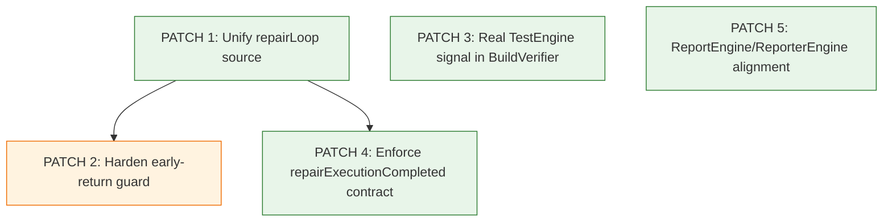

# IMPLEMENTATION_ORDER

Dokumen ini adalah rencana implementasi teknis (tanpa perubahan kode pada fase ini), berbasis:
- FORENSIC_AUDIT.md
- ROOT_CAUSE_ANALYSIS.md

## 1) Independent Bug Table

| Bug ID | Severity | Root Cause | Affected Files | Affected Functions | Dependencies | Regression Tests Required | Estimated Risk |
|---|---|---|---|---|---|---|---|
| IB-01 | Critical | Kontrak state `repairLoop` tidak konsisten (`context.repairLoop` vs `context.metadata.repairLoop`) | SATSET-BUG/src/ai/engines/RepairLoopEngine.ts; SATSET-BUG/src/autofix/AutoRepairEngine.ts; SATSET-BUG/src/doctor/VerificationEngine.ts; SATSET-BUG/src/core/Context.ts | `RepairLoopEngine.run`; `AutoRepairEngine.run`; `VerificationEngine.verifyRepairOutcome` | Prasyarat untuk stabilisasi loop guard (P2) | Tambah test sinkronisasi state: assert `context.repairLoop` dan `metadata.repairLoop` konsisten setelah run; E2E jalur `DoctorOrchestrator.run` | High (menyentuh kontrak lintas engine) |
| IB-02 | High | Kontrak hasil test tidak terhubung ke output nyata TestEngine (`testsPassed = true` hardcoded) | SATSET-BUG/src/doctor/BuildVerifier.ts; SATSET-BUG/src/doctor/RepairCoordinator.ts; (kemungkinan) SATSET-BUG/src/ai/engines/TestEngine.ts | `BuildVerifier.verify`; `RepairCoordinator.run` | Tidak bergantung ke IB-01, tetapi lebih aman setelah state stabil | Tambah unit test BuildVerifier untuk skenario test fail/pass; integrasi RepairCoordinator status gating by real test result | Medium (perubahan logika status) |
| IB-03 | Medium | Producer `metadata.repairExecutionCompleted` tidak dijamin aktif di jalur `DoctorOrchestrator.run` | SATSET-BUG/src/doctor/DoctorOrchestrator.ts; SATSET-BUG/src/autofix/AutoRepairEngine.ts; SATSET-BUG/src/planner/RepairEngine.ts | `DoctorOrchestrator.run`; `AutoRepairEngine.run`; `RepairEngine.run` | Sebaiknya setelah IB-01 agar kontrak state utama sudah jelas | Tambah integration test orchestrator: verifikasi field `repairExecutionCompleted` tidak ambiguous; tambah test undefined flag behavior | Medium |
| IB-04 | Low | Naming contract mismatch: target `ReportEngine` tidak ada, implementasi `ReporterEngine` | SATSET-BUG/src/report/ReporterEngine.ts; SATSET-BUG/src/doctor/Doctor.ts; dokumentasi audit/arsitektur terkait | `ReporterEngine.run`; wiring pipeline/report registry | Independen penuh | Tambah contract test/metadata test untuk nama engine reporting; update doc consistency checks | Low |

Catatan:
- BUG-02 pada ROOT_CAUSE_ANALYSIS (early-return stale-state) adalah bug turunan yang ditangani sebagai patch khusus setelah IB-01 untuk meminimalkan regressi.

---

## 2) Patch Sequence

### PATCH 1 — Unify Repair Loop Source of Truth
- File:
  - SATSET-BUG/src/core/Context.ts
  - SATSET-BUG/src/ai/engines/RepairLoopEngine.ts
  - SATSET-BUG/src/autofix/AutoRepairEngine.ts
  - SATSET-BUG/src/doctor/VerificationEngine.ts
- Reason:
  - Menutup akar masalah IB-01 (split-brain state).
- Preconditions:
  - Definisikan kontrak final: `context.repairLoop` sebagai canonical state.
  - `metadata.repairLoop` hanya mirror/read-only snapshot jika masih diperlukan.
- Expected Effect:
  - Semua engine membaca status repair dari sumber yang sama.
  - Hilang mismatch antara outcome loop dan verifikasi.
- Regression Tests:
  - New: `repair-loop-state-canonical.test.ts`.
  - Update: `repair-loop-engine.test.ts`, `repair-state-consistency.test.ts`.
  - New integration: `doctor-orchestrator-repairloop-consistency.test.ts`.
- Rollback Strategy:
  - Kembalikan hanya kontrak mapping `repairLoop` (single commit rollback untuk patch ini).
  - Pertahankan test baru untuk mendeteksi regressi saat rollback.

---

### PATCH 2 — Harden Early-Return Guard in RepairLoopEngine (Derived Bug)
- File:
  - SATSET-BUG/src/ai/engines/RepairLoopEngine.ts
- Reason:
  - Menutup bug turunan (stale early-return) yang muncul karena state reuse antar run.
- Preconditions:
  - PATCH 1 sudah aktif (canonical state tersedia).
- Expected Effect:
  - Early return hanya terjadi setelah validasi issue aktual (dan optional compile signal terbaru).
  - Mencegah skip repair akibat state lama.
- Regression Tests:
  - New: `repair-loop-multirun-stale-state.test.ts`.
  - Extend: `regression-repair-loop-ordering.test.ts` dengan skenario reuse context multi-run.
- Rollback Strategy:
  - Revert perubahan guard logic saja; pertahankan instrumentation test untuk investigasi.

---

### PATCH 3 — Wire Real Test Result into BuildVerifier
- File:
  - SATSET-BUG/src/doctor/BuildVerifier.ts
  - SATSET-BUG/src/doctor/RepairCoordinator.ts
  - (opsional jika perlu expose result) SATSET-BUG/src/ai/engines/TestEngine.ts
- Reason:
  - Menutup IB-02 (false positive test status).
- Preconditions:
  - Definisikan format result test yang dapat dikonsumsi stabil (metadata/artifact contract).
- Expected Effect:
  - `testsPassed` mencerminkan hasil test sebenarnya.
  - `RepairCoordinator` status lebih akurat.
- Regression Tests:
  - New: `build-verifier.test.ts` (pass/fail cases).
  - New: `repair-coordinator-test-failure-gating.test.ts`.
  - Extend: `doctor-orchestrator.test.ts` untuk assert semantik status, bukan hanya artifact presence.
- Rollback Strategy:
  - Revert integrasi pembacaan test result di BuildVerifier dan RepairCoordinator.
  - Jaga test baru tetap berjalan untuk menandai gap yang kembali.

---

### PATCH 4 — Enforce `repairExecutionCompleted` Contract on Orchestrator Path
- File:
  - SATSET-BUG/src/doctor/DoctorOrchestrator.ts
  - SATSET-BUG/src/autofix/AutoRepairEngine.ts
  - SATSET-BUG/src/planner/RepairEngine.ts
- Reason:
  - Menutup IB-03 (read field yang producer-nya tidak selalu berjalan).
- Preconditions:
  - Putuskan desain final:
    - Opsi A: jalankan RepairEngine sebelum AutoRepairEngine path tertentu.
    - Opsi B: AutoRepairEngine gunakan fallback explicit non-permissive bila flag undefined.
- Expected Effect:
  - Tidak ada ambiguitas undefined pada `repairExecutionCompleted`.
  - Lifecycle tidak mem-mask eksekusi parsial.
- Regression Tests:
  - Extend: `regression-bug2-maxsteps-incomplete.test.ts` ke jalur orchestrator nyata.
  - New: `orchestrator-repair-execution-completed-contract.test.ts`.
- Rollback Strategy:
  - Revert contract enforcement ke perilaku sebelumnya.
  - Keep failing tests sebagai guard agar rollback terukur dan sementara.

---

### PATCH 5 — Align ReportEngine/ReporterEngine Contract
- File:
  - SATSET-BUG/src/report/ReporterEngine.ts
  - SATSET-BUG/src/doctor/Doctor.ts
  - Dokumen arsitektur yang menyebut `ReportEngine`
- Reason:
  - Menutup IB-04 (naming mismatch, risiko wiring/dokumentasi).
- Preconditions:
  - Konfirmasi naming final yang jadi standard di registry, docs, audit.
- Expected Effect:
  - Konsistensi naming engine reporting di kode dan dokumentasi.
- Regression Tests:
  - New: `reporting-engine-contract.test.ts`.
  - Extend: smoke test pipeline agar reporter tetap dieksekusi.
- Rollback Strategy:
  - Revert rename/alias docs-wiring jika ada side effect pada integrasi eksternal.

---

## 3) Dependency Check Antar Patch

### Dependency List
- P1 -> P2 (wajib)
- P1 -> P4 (direkomendasikan)
- P3 independen (dapat paralel setelah P1, tetapi disarankan sesudah P2 untuk review risiko lebih bersih)
- P5 independen penuh

### Validasi Constraint
- Tidak ada circular dependency: terpenuhi.
- Tidak ada patch yang membutuhkan patch berikutnya: terpenuhi.
- Setiap patch bisa direview independen:
  - P1: kontrak state
  - P2: guard behavior
  - P3: test signal plumbing
  - P4: orchestration contract
  - P5: naming contract

---

## 4) Dependency Diagram

---

## 5) Estimated Files Changed

Per patch (estimasi):
- P1: 4 files
- P2: 1 file
- P3: 2-3 files
- P4: 2-3 files
- P5: 2-4 files (tergantung cakupan dokumentasi)

Total unique files (de-duplicated, estimasi): 8-11 files.

---

## 6) Estimated LOC

Per patch (estimasi netto):
- P1: 40-90 LOC
- P2: 20-45 LOC
- P3: 30-80 LOC
- P4: 25-70 LOC
- P5: 15-50 LOC

Total estimasi: 130-335 LOC.

---

## 7) Expected Test Impact

- Unit test baru: 4-6 file.
- Integrasi/regresi update: 4-7 file.
- Area paling terdampak:
  - repair loop lifecycle
  - verification/build gating
  - orchestrator contract
  - reporting contract naming

Target hasil test setelah implementasi:
- Tidak ada false-positive `testsPassed`.
- Tidak ada mismatch `context.repairLoop` vs `metadata.repairLoop`.
- Tidak ada early-return stale-state tanpa validasi issue aktual.
- `repairExecutionCompleted` memiliki kontrak tegas di jalur orchestrator.

---

## 8) Risk Matrix

| Patch | Functional Risk | Regression Risk | Integration Risk | Overall |
|---|---|---|---|---|
| P1 | High | High | Medium | High |
| P2 | Medium | Medium | Low | Medium |
| P3 | Medium | Medium | Medium | Medium |
| P4 | Medium | Medium | Medium | Medium |
| P5 | Low | Low | Medium (naming consumers) | Low-Medium |

Mitigasi utama:
- Review per patch kecil (no mega patch).
- Jalankan regression suite setiap patch.
- Gunakan feature-compatible contract (alias/mirror sementara jika perlu).

---

## 9) Rollback Plan

Prinsip:
- Satu patch = satu rollback unit.
- Rollback hanya patch terbaru yang menyebabkan breakage (LIFO).
- Test tambahan tidak dihapus saat rollback agar gap tetap terdeteksi.

Langkah rollback operasional:
1. Identifikasi patch pemicu kegagalan dari CI/test delta.
2. Revert patch tersebut saja.
3. Jalankan subset test terdampak + smoke orchestrator.
4. Jika stabil, lanjut hotfix kecil pada patch yang di-revert sebelum re-apply.

Urutan rollback prioritas:
- Jika masalah state lintas engine: rollback P2 dulu, lalu P1 bila perlu.
- Jika masalah build gating: rollback P3.
- Jika masalah orchestration contract: rollback P4.
- Jika masalah kompatibilitas naming eksternal: rollback P5.

---

## 10) Patch Sequence (Final Order)

1. PATCH 1 — Unify Repair Loop Source of Truth
2. PATCH 2 — Harden Early-Return Guard
3. PATCH 3 — Wire Real Test Result into BuildVerifier
4. PATCH 4 — Enforce `repairExecutionCompleted` Contract
5. PATCH 5 — Align ReportEngine/ReporterEngine Contract

Rationale urutan:
- Stabilkan kontrak state dulu (P1), lalu guard behavior turunan (P2).
- Setelah state aman, perbaiki keakuratan quality gate (P3).
- Kemudian kencangkan kontrak orchestrator metadata (P4).
- Akhiri dengan patch naming berisiko rendah (P5).
