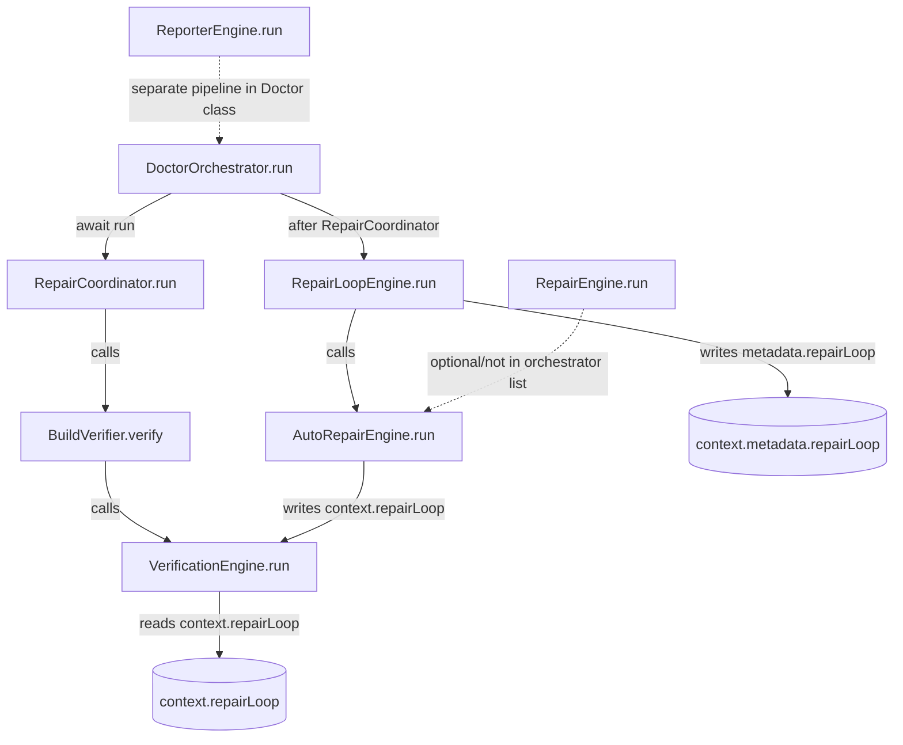

# ROOT_CAUSE_ANALYSIS

Analisis ini berbasis bukti source code dan test yang ada, tanpa perubahan kode.

## Sumber Bukti
- FORENSIC_AUDIT.md
- SATSET-BUG/src/doctor/DoctorOrchestrator.ts
- SATSET-BUG/src/doctor/RepairCoordinator.ts
- SATSET-BUG/src/doctor/BuildVerifier.ts
- SATSET-BUG/src/doctor/VerificationEngine.ts
- SATSET-BUG/src/ai/engines/RepairLoopEngine.ts
- SATSET-BUG/src/autofix/AutoRepairEngine.ts
- SATSET-BUG/src/planner/RepairEngine.ts
- SATSET-BUG/src/repair/RepairLifecycle.ts
- SATSET-BUG/src/core/Context.ts
- SATSET-BUG/src/report/ReporterEngine.ts
- SATSET-BUG/tests/doctor-orchestrator.test.ts
- SATSET-BUG/tests/repair-loop-engine.test.ts
- SATSET-BUG/tests/regression-repair-loop-ordering.test.ts
- SATSET-BUG/tests/regression-bug1-repair-loop-no-verification.test.ts
- SATSET-BUG/tests/repair-state-consistency.test.ts
- SATSET-BUG/tests/regression-bug2-maxsteps-incomplete.test.ts

---

## 1) Klasifikasi Bug

### Critical

#### BUG-01: Split state `repairLoop` (source of truth terpecah antara `context` vs `metadata`)
- Root Cause:
  - `RepairLoopEngine` menulis ke `context.metadata.repairLoop`.
  - `VerificationEngine` membaca dari `context.repairLoop`.
  - Kontrak data antar engine tidak konsisten.
- Dampak:
  - Verifikasi bisa membaca status loop yang stale/undefined.
  - Pipeline dapat menilai outcome repair tidak sesuai state terbaru.
- Engine terlibat:
  - RepairLoopEngine, VerificationEngine, AutoRepairEngine.
- File:
  - SATSET-BUG/src/ai/engines/RepairLoopEngine.ts
  - SATSET-BUG/src/doctor/VerificationEngine.ts
  - SATSET-BUG/src/autofix/AutoRepairEngine.ts
- Fungsi:
  - `RepairLoopEngine.run`
  - `VerificationEngine.verifyRepairOutcome`
  - `AutoRepairEngine.run`
- Line Number:
  - Write metadata loop: RepairLoopEngine.ts:89-92
  - Read context loop: VerificationEngine.ts:227, 318
  - Write context loop: AutoRepairEngine.ts:50-54, 153-157
- Data yang dibaca:
  - `context.repairLoop.reason`
- Data yang ditulis:
  - `context.metadata.repairLoop`
  - `context.repairLoop`
- Mengapa lolos dari test sebelumnya:
  - Test loop fokus ke `metadata.repairLoop` saja, bukan sinkronisasi dengan `context.repairLoop`:
    - SATSET-BUG/tests/repair-loop-engine.test.ts (assert ke metadata)
    - SATSET-BUG/tests/regression-repair-loop-ordering.test.ts (helper `getRepairLoopMeta` ambil metadata)
  - Tidak ada test end-to-end yang menegaskan kedua field wajib konsisten setelah seluruh pipeline.

### High

#### BUG-02: Early-return stale-state di `RepairLoopEngine`
- Root Cause:
  - Guard awal return jika `context.repairLoop.completed` dan reason terminal, sebelum revalidasi issue terkini.
- Dampak:
  - Compile/repair loop bisa diskip terlalu cepat berdasarkan state lama dari run sebelumnya.
  - Unresolved issue berpotensi tidak diproses di run berjalan.
- Engine terlibat:
  - RepairLoopEngine (utama), AutoRepairEngine (producer reason).
- File:
  - SATSET-BUG/src/ai/engines/RepairLoopEngine.ts
- Fungsi:
  - `RepairLoopEngine.run`
- Line Number:
  - Early return: RepairLoopEngine.ts:26-34
- Data yang dibaca:
  - `context.repairLoop.completed`
  - `context.repairLoop.reason`
- Data yang ditulis:
  - `context.metadata.repairLoop` (return path)
- Mengapa lolos dari test sebelumnya:
  - Test regresi memverifikasi skenario `verification` undefined/stale, bukan stale `context.repairLoop` dari run sebelumnya:
    - SATSET-BUG/tests/regression-repair-loop-ordering.test.ts
    - SATSET-BUG/tests/regression-bug1-repair-loop-no-verification.test.ts
  - Tidak ada test multi-run reuse context yang memaksa recompute issue state sebelum early return.

#### BUG-03: `BuildVerifier` meng-hardcode hasil test (`testsPassed = true`)
- Root Cause:
  - BuildVerifier tidak membaca output TestEngine, hanya set konstanta true.
- Dampak:
  - False-positive status test di hasil verifikasi build.
  - Akurasi `status` di RepairCoordinator menurun karena komponen test selalu dianggap lolos.
- Engine terlibat:
  - RepairCoordinator, BuildVerifier, TestEngine, VerificationEngine.
- File:
  - SATSET-BUG/src/doctor/BuildVerifier.ts
  - SATSET-BUG/src/doctor/RepairCoordinator.ts
- Fungsi:
  - `BuildVerifier.verify`
  - `RepairCoordinator.run`
- Line Number:
  - Hardcoded: BuildVerifier.ts:18
  - Konsumsi hasil verifikasi: RepairCoordinator.ts:69-71
- Data yang dibaca:
  - `context.verification`
  - `compileResult.succeeded`
- Data yang ditulis:
  - Return object `BuildVerificationResult.testsPassed`
- Mengapa lolos dari test sebelumnya:
  - Tidak ada test yang memalsukan kegagalan TestEngine lalu mengecek `BuildVerifier.testsPassed`.
  - Pencarian test tidak menemukan test spesifik BuildVerifier.
  - `doctor-orchestrator.test.ts` hanya validasi artifact existence, bukan semantik status verifikasi.

### Medium

#### BUG-04: Kontrak `repairExecutionCompleted` tidak terjamin di jalur `DoctorOrchestrator`
- Root Cause:
  - `AutoRepairEngine` membaca `metadata.repairExecutionCompleted`.
  - Field tersebut diisi oleh `RepairEngine`, tetapi `RepairEngine` tidak dipanggil dalam `DoctorOrchestrator.run`.
- Dampak:
  - Nilai undefined diperlakukan sebagai `true` (`!== false`), berpotensi masking status eksekusi parsial.
  - Status lifecycle dapat bias saat jalur orchestrator tertentu tidak pernah mengisi flag ini.
- Engine terlibat:
  - DoctorOrchestrator, AutoRepairEngine, RepairEngine.
- File:
  - SATSET-BUG/src/doctor/DoctorOrchestrator.ts
  - SATSET-BUG/src/autofix/AutoRepairEngine.ts
  - SATSET-BUG/src/planner/RepairEngine.ts
- Fungsi:
  - `DoctorOrchestrator.run`
  - `AutoRepairEngine.run`
  - `RepairEngine.run`
- Line Number:
  - Read flag: AutoRepairEngine.ts:140
  - Write flag: RepairEngine.ts:71-74
  - Orchestrator tidak memanggil RepairEngine: DoctorOrchestrator.ts:65-121
- Data yang dibaca:
  - `context.metadata.repairExecutionCompleted`
- Data yang ditulis:
  - `context.metadata.repairExecutionCompleted` (hanya jika RepairEngine dijalankan)
- Mengapa lolos dari test sebelumnya:
  - Test `regression-bug2-maxsteps-incomplete` menguji `RepairEngine` + `deriveRepairLifecycleState` secara terpisah, bukan jalur nyata DoctorOrchestrator.
  - Tidak ada test integrasi yang memastikan flag ini selalu tersedia di path orchestrator.

### Low

#### BUG-05: Ketidaksesuaian target `ReportEngine` vs implementasi nyata `ReporterEngine`
- Root Cause:
  - Tidak ada class `ReportEngine`; yang ada `ReporterEngine`.
  - Ketidakselarasan naming/ekspektasi arsitektur.
- Dampak:
  - Risiko salah wiring di dokumentasi, audit, atau pemanggilan otomatis berbasis nama class.
- Engine terlibat:
  - ReporterEngine (dan komponen yang mengharapkan ReportEngine).
- File:
  - SATSET-BUG/src/report/ReporterEngine.ts
- Fungsi:
  - `ReporterEngine.run`
- Line Number:
  - Deklarasi class: ReporterEngine.ts:5-6
  - run: ReporterEngine.ts:17-18
- Data yang dibaca:
  - `context` (disalurkan ke reporter manager)
- Data yang ditulis:
  - Tidak menulis context langsung.
- Mengapa lolos dari test sebelumnya:
  - Test orchestrator memverifikasi artifact output, bukan konsistensi naming target audit vs implementasi class.

---

## 2) Dependency Graph + Tanda RAW/RBW/Stale/Circular

### Penandaan dependency

- ✓ Read After Write
  - BuildVerifier: `await verificationEngine.run(context)` lalu read `context.verification`.
    - Bukti: BuildVerifier.ts:16-17.
  - RepairCoordinator.runCompile: compileEngine.run lalu read `metadata.compile`.
    - Bukti: RepairCoordinator.ts:90-91, CompileEngine.ts:44-46.

- ⚠ Read Before Write / May Undefined
  - AutoRepairEngine read `metadata.repairExecutionCompleted` pada jalur orchestrator yang tidak selalu menulis field ini.
    - Bukti: AutoRepairEngine.ts:140, RepairEngine.ts:71-74, DoctorOrchestrator.ts:65-121.

- ✗ Circular Dependency
  - Tidak ditemukan circular dependency struktural langsung (call cycle sinkron) antar target engine pada jalur `DoctorOrchestrator.run`.

- ✗ Stale State
  - `RepairLoopEngine` early-return berdasarkan `context.repairLoop` lama.
    - Bukti: RepairLoopEngine.ts:26-34.
  - Split state `metadata.repairLoop` vs `context.repairLoop`.
    - Bukti: RepairLoopEngine.ts:89-92 vs VerificationEngine.ts:227,318.

---

## 3) Causal Chain (Bug akibat bug lain)

### Chain-1
BUG-01 (Split state repairLoop)
↓ menyebabkan
Bug pada pembacaan outcome repair yang tidak konsisten di VerificationEngine
↓ memperbesar peluang
False assessment pada status verifikasi di fase repair

### Chain-2
BUG-01 (split state) + BUG-02 (early-return stale)
↓ kombinasi
Loop berhenti dengan konteks yang tidak selalu representatif kondisi issue terbaru

### Chain-3
BUG-04 (kontrak metadata tidak dijamin di jalur orchestrator)
↓ menyebabkan
AutoRepairEngine memakai default permissive (`!== false`)
↓ mengurangi sensitivitas deteksi eksekusi parsial

Catatan:
- BUG-03 (hardcoded testsPassed) berdiri sendiri; tidak disebabkan langsung oleh BUG-01/02/04.
- BUG-05 (naming mismatch) berdiri sendiri pada lapisan kontrak/arsitektur.

---

## 4) Jumlah Bug Independen (yang benar-benar akar)

Total bug teridentifikasi: 5.

Bug independen (akar) yang perlu ditangani langsung: 4.
- RC-A: Kontrak state lintas engine tidak konsisten (`context` vs `metadata`) -> memunculkan BUG-01 dan berkontribusi besar pada BUG-02.
- RC-B: Kontrak verifikasi test tidak diikat ke output nyata TestEngine -> BUG-03.
- RC-C: Kontrak orchestration tidak menjamin producer field dijalankan -> BUG-04.
- RC-D: Ketidaksinkronan naming engine (ReportEngine vs ReporterEngine) -> BUG-05.

BUG-02 dinilai semi-turunan dari RC-A, meski tetap perlu patch spesifik pada guard logic.

---

## 5) Urutan Implementasi Fix Paling Aman

Step 1
- Konsolidasi source of truth untuk `repairLoop` (utamakan `context.repairLoop`, metadata hanya mirror).
- Tujuan: menutup BUG-01 dan mengurangi blast radius state drift.

Step 2
- Rework guard early-return `RepairLoopEngine` agar selalu validasi issue aktual sebelum return.
- Tujuan: menutup BUG-02 setelah kontrak state konsisten.

Step 3
- Perbaiki kontrak BuildVerifier agar `testsPassed` berasal dari hasil TestEngine nyata.
- Tujuan: menutup BUG-03 (akurasi status repair iteration).

Step 4
- Tegaskan kontrak `repairExecutionCompleted` pada jalur orchestrator (producer selalu jalan atau fallback eksplisit ketat).
- Tujuan: menutup BUG-04 tanpa masking undefined.

Step 5
- Sinkronkan naming/kontrak ReportEngine vs ReporterEngine (kode + dokumentasi + registrasi).
- Tujuan: menutup BUG-05 (risiko integrasi jangka panjang).

---

## 6) Ringkasan Severity
- Critical: 1
- High: 2
- Medium: 1
- Low: 1

Kesimpulan:
- Akar utama ada pada kontrak data lintas engine dan coverage test integrasi yang lebih fokus ke artifact existence dibanding invariants state pipeline.
