# SATSET AI Factory V6 Architecture Specification

## Document Status

- Status: Normative
- Version: 6.0.0
- Owner: Chief Software Architect
- Scope: This specification defines the authoritative architecture for SATSET AI Factory Version 6.
- Applies To: All runtime systems, compilers, schedulers, registries, plugins, release processes, validation workflows, and supporting tooling.
- Rule: Any implementation, extension, integration, or migration activity MUST conform to this specification.

## 1. Architecture Philosophy

### Purpose
The architecture of SATSET AI Factory V6 MUST prioritize predictability, composability, traceability, and resilient automation over ad hoc behavior.

### Responsibilities
- Define the authoritative runtime model for doctor, factory, scheduler, resolver, registry, artifact, and recovery systems.
- Ensure every subsystem can be reasoned about independently and composed into larger workflows.
- Preserve deterministic outcomes in the presence of partial failures.
- Provide a clear contract between execution layers and supporting services.

### Allowed behavior
- A runtime MAY execute work in a controlled and observable manner.
- An engine MAY publish manifests describing capabilities and constraints.
- A pipeline MAY be resolved through explicit dependency analysis.
- A workflow MAY support retries, rollbacks, and recovery annotations.

### Forbidden behavior
- Implementations MUST NOT rely on hidden global state for correctness.
- Implementations MUST NOT omit dependency declarations.
- Implementations MUST NOT execute work without observable lifecycle transitions.
- Implementations MUST NOT create ambiguous artifact ownership.

### Sequence diagram
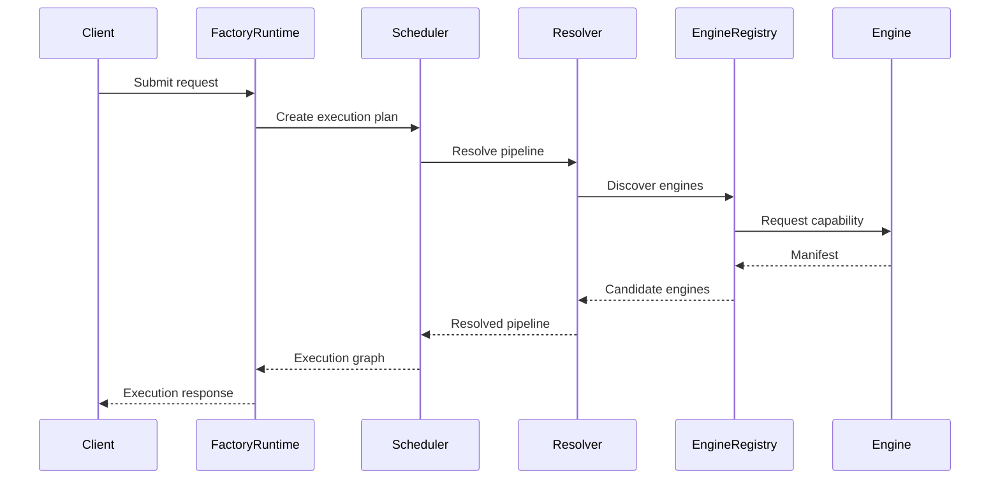

### Mermaid diagram
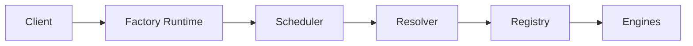

### Examples
- A build request MUST be interpreted as a pipeline request with explicit steps.
- A test request MUST be tracked through validation, reporting, and artifact publishing.

### Future extensibility
The architecture MUST allow new execution engines, artifact transports, and recovery strategies without altering the core contract.

### Migration impact
Migration to V6 MUST preserve the semantic meaning of existing operations even when implementation details change.

### Performance considerations
The architecture SHOULD minimize unnecessary indirection while preserving observability and safety.

### Failure handling
If a subsystem cannot establish a contract, it MUST fail loudly and produce a diagnostic record.

### Recovery handling
Recovery MUST occur through declared state transitions rather than ad hoc retries.

### Best practices
- Prefer explicit contracts over implicit assumptions.
- Keep runtime orchestration centralized and auditable.

### Anti-patterns
- Hidden coupling between runtime layers.
- State being mutated without lifecycle events.

---

## 2. Design Principles

### Purpose
This section defines the foundational design principles that govern every V6 subsystem.

### Responsibilities
- Preserve modularity.
- Encourage explicit dependency declarations.
- Keep contracts stable across releases.

### Allowed behavior
- Components MAY depend on abstractions rather than concrete implementations.
- Interfaces MAY evolve through additive changes.

### Forbidden behavior
- Components MUST NOT bypass the declared runtime contract.
- Components MUST NOT depend on implementation details that are not part of the contract.

### Sequence diagram
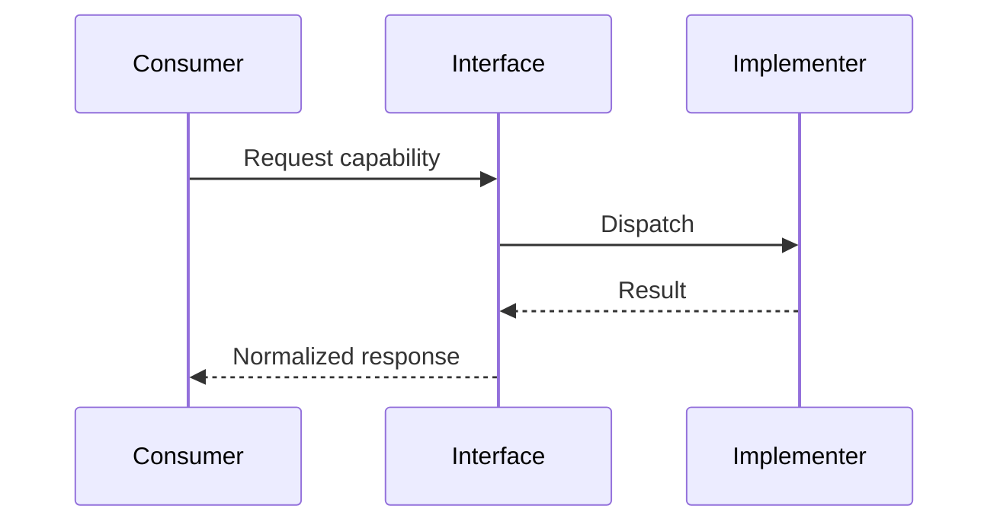

### Mermaid diagram
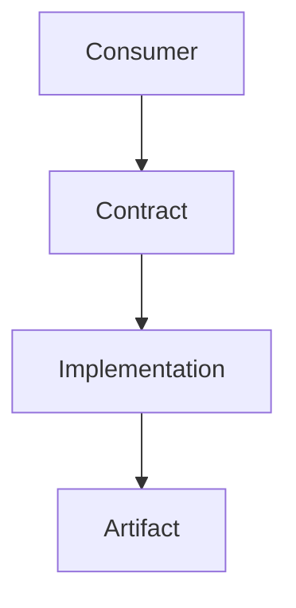

### Examples
- A scheduler SHOULD depend on a pipeline resolver interface rather than a specific resolver implementation.

### Future extensibility
New implementations MAY be plugged in if they satisfy the same contract.

### Migration impact
Existing components SHOULD be adapted through interface conformance rather than code duplication.

### Performance considerations
Abstraction layers MUST remain lightweight and avoid expensive reflection or dynamic inspection where simple dispatch suffices.

### Failure handling
A contract violation MUST be treated as a first-class error and surfaced to the caller.

### Recovery handling
Recovery logic SHOULD use contract-level fallback paths.

### Best practices
- Prefer stable public contracts with versioned evolution.

### Anti-patterns
- Replacing a contract with ad hoc conventions.

---

## 3. Runtime Philosophy

### Purpose
Runtime philosophy defines how execution environments behave under orchestration, failure, and scale.

### Responsibilities
- Provide consistent lifecycle boundaries.
- Ensure each execution has explicit context and identity.
- Preserve auditability.

### Allowed behavior
- A runtime MAY spawn child tasks for parallel work.
- A runtime MAY create isolated working directories.

### Forbidden behavior
- A runtime MUST NOT silently continue after critical contract failure.
- A runtime MUST NOT mutate shared state without synchronization.

### Sequence diagram
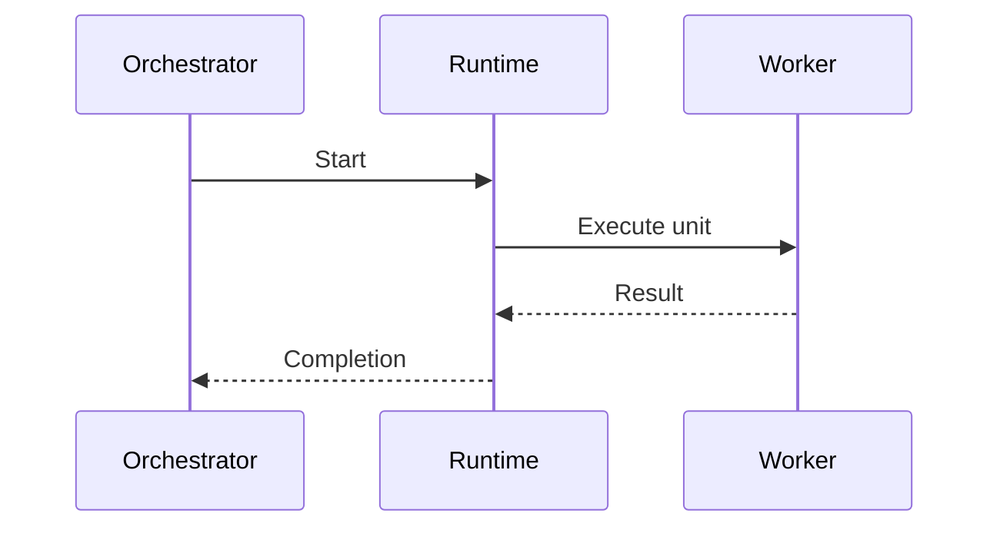

### Mermaid diagram
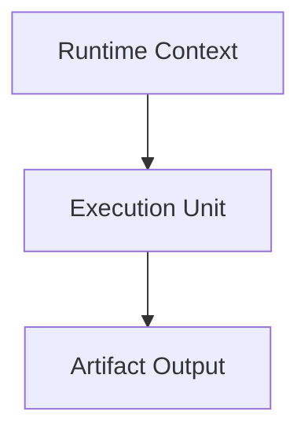

### Examples
- A compile runtime MUST create a workspace, execute the compiler, and emit artifacts.

### Future extensibility
A runtime SHOULD allow custom hooks for pre-execution, post-execution, and recovery.

### Migration impact
Legacy runtimes MUST be wrapped with V6-compatible lifecycle adapters.

### Performance considerations
Runtime initialization SHOULD be amortized through reusable context and caching.

### Failure handling
Runtime errors MUST generate structured diagnostics.

### Recovery handling
The runtime SHOULD support restart from the last safe checkpoint or a declared retry boundary.

### Best practices
- Keep runtime state explicit and recoverable.

### Anti-patterns
- Long-lived implicit state inside global singletons.

---

## 4. Doctor Runtime Contract

### Purpose
The doctor runtime is the authoritative execution environment for health, validation, analysis, and repair-oriented tasks.

### Responsibilities
- Evaluate environment health.
- Detect contract violations.
- Prepare remediation recommendations and repair operations.

### Allowed behavior
- The doctor runtime MAY inspect files, configurations, logs, and execution traces.
- The doctor runtime MAY produce repair hints and repair plan artifacts.

### Forbidden behavior
- The doctor runtime MUST NOT alter the source of truth without explicit approval from a declared repair lifecycle.
- The doctor runtime MUST NOT ignore critical validation failures.

### Sequence diagram
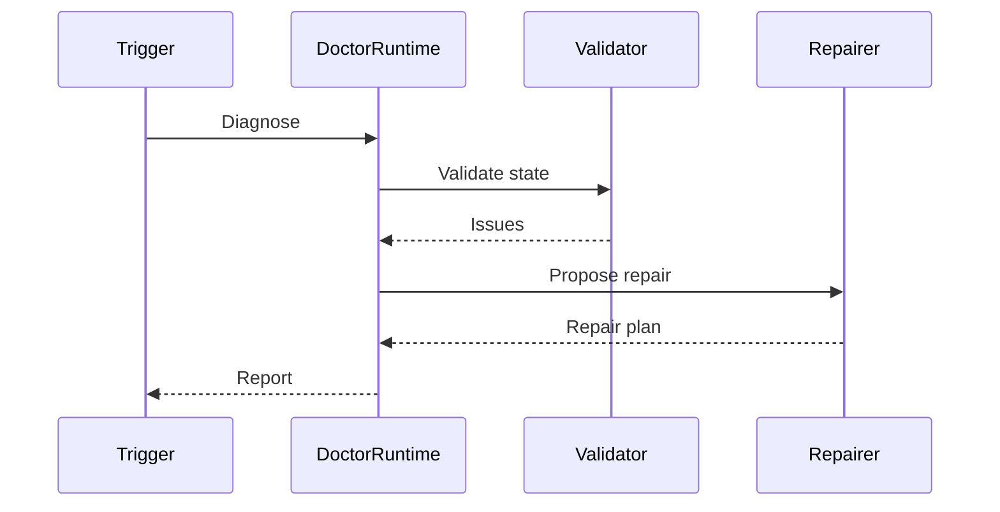

### Mermaid diagram
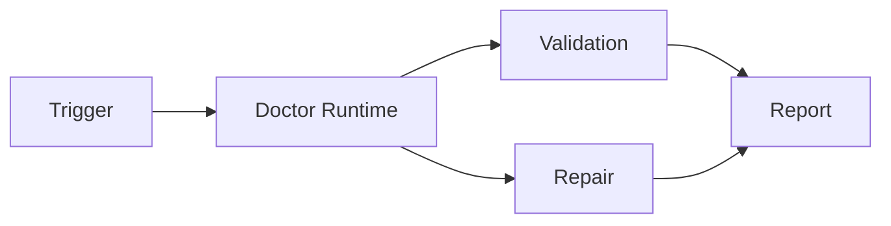

### Examples
- The doctor runtime MAY detect missing configuration values, invalid manifests, and broken dependency declarations.

### Future extensibility
The doctor runtime SHOULD support domain-specific analyzers through plugin registration.

### Migration impact
Legacy diagnostics SHOULD be normalized into the V6 error, logging, and artifact contracts.

### Performance considerations
Diagnosis SHOULD be bounded by time and resource budgets.

### Failure handling
A failing diagnosis session MUST still emit a diagnostic artifact and a structured failure state.

### Recovery handling
The doctor runtime SHOULD preserve intermediate findings to allow retries or escalation.

### Best practices
- Separate diagnosis from repair execution.

### Anti-patterns
- Combining analysis and mutation into a single uncontrolled path.

---

## 5. Factory Runtime Contract

### Purpose
The factory runtime is the primary orchestrator for end-to-end work execution across pipelines, modules, and release stages.

### Responsibilities
- Accept execution requests.
- Resolve the appropriate pipeline.
- Coordinate worker execution.
- Publish results and artifacts.

### Allowed behavior
- The factory runtime MAY invoke multiple engines in sequence or in parallel.
- The factory runtime MAY create transient execution contexts.

### Forbidden behavior
- The factory runtime MUST NOT bypass the scheduler or resolver.
- The factory runtime MUST NOT directly mutate artifacts outside the artifact contract.

### Sequence diagram
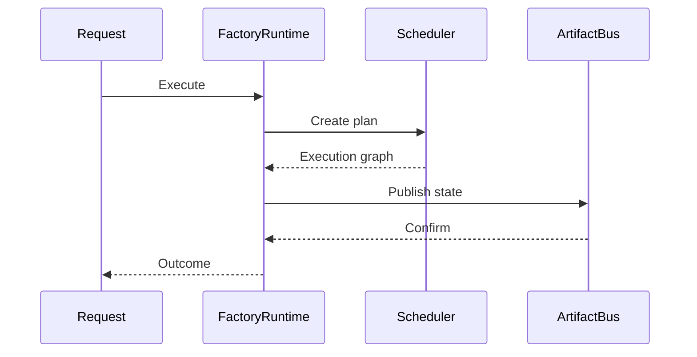

### Mermaid diagram
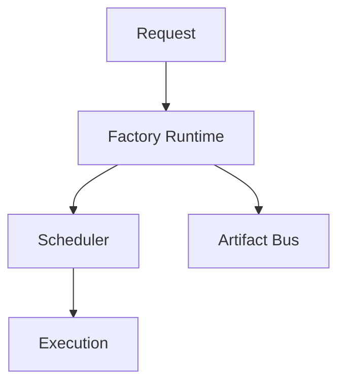

### Examples
- The factory runtime MAY handle a release request that triggers compile, test, and packaging pipelines.

### Future extensibility
The factory runtime SHOULD support new execution domains such as packaging, deployment, or compliance.

### Migration impact
Existing monolithic execution flows MUST be decomposed into pipeline steps that fit the V6 contract.

### Performance considerations
The factory runtime SHOULD minimize context thrashing and batching overhead.

### Failure handling
Any failure in a child stage MUST be propagated as a typed error with scope and stage context.

### Recovery handling
The factory runtime SHOULD support restart from an identifiable checkpoint or stage boundary.

### Best practices
- Use a single canonical execution identifier for every request.

### Anti-patterns
- Treating each pipeline operation as an isolated ad hoc script.

---

## 6. Pipeline Contract

### Purpose
The pipeline contract defines how work is represented and executed as a composed sequence of stages.

### Responsibilities
- Define stage ordering and dependencies.
- Declare explicit inputs and outputs.
- Enable deterministic resolution and replay.

### Allowed behavior
- A pipeline MAY contain sequential, conditional, or parallel stages.
- A pipeline MAY reference reusable engine manifests.

### Forbidden behavior
- A pipeline MUST NOT rely on implicit ordering.
- A pipeline MUST NOT permit undeclared side effects.

### Sequence diagram
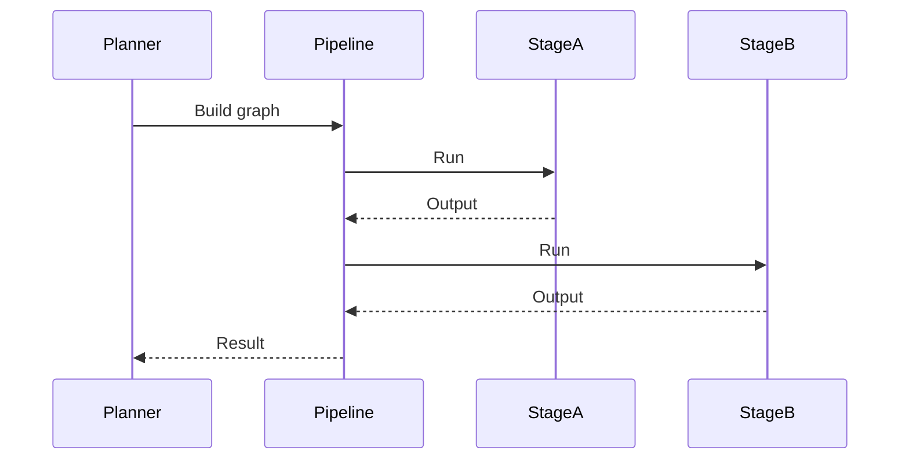

### Mermaid diagram
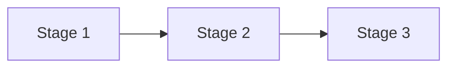

### Examples
- A compile pipeline MAY consist of discovery, compilation, bundling, and artifact publication.

### Future extensibility
Pipelines SHOULD support dynamic stage selection based on context and manifests.

### Migration impact
Legacy build scripts MUST be represented as stage-based pipelines instead of free-form commands.

### Performance considerations
Stage granularity SHOULD be selected to maximize concurrency without excessive scheduling overhead.

### Failure handling
A stage failure MUST quarantine the affected branch and prevent invalid downstream progression.

### Recovery handling
Pipelines SHOULD support partial replay from the first safe stage after failure.

### Best practices
- Favor immutable pipeline definitions.

### Anti-patterns
- Dynamic stage injection without manifest validation.

---

## 7. Execution Scheduler Contract

### Purpose
The execution scheduler governs when and how work is launched.

### Responsibilities
- Select runnable work items.
- Apply concurrency and batching policy.
- Track state transitions.

### Allowed behavior
- The scheduler MAY reorder work when dependencies are satisfied.
- The scheduler MAY impose resource constraints.

### Forbidden behavior
- The scheduler MUST NOT launch work with unknown dependencies.
- The scheduler MUST NOT violate declared concurrency limits.

### Sequence diagram
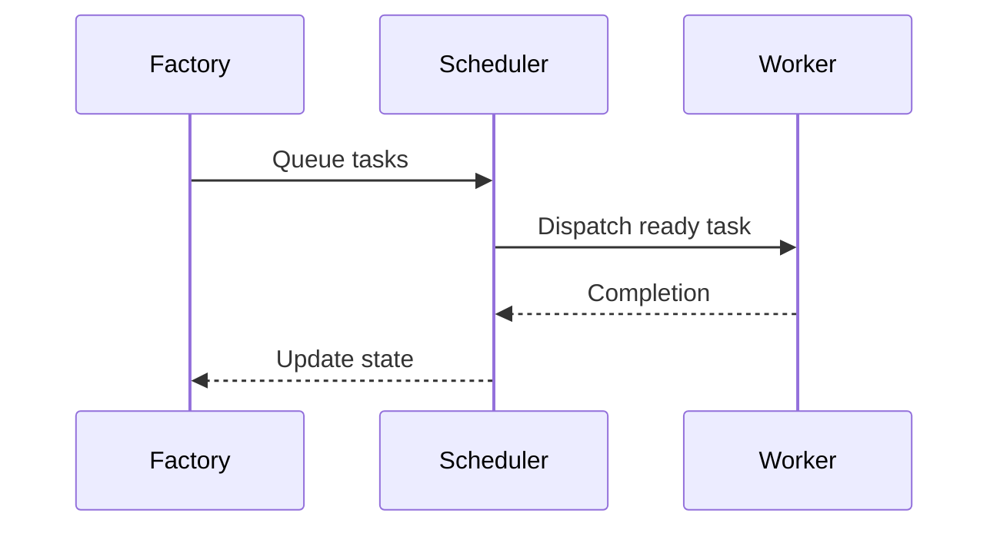

### Mermaid diagram
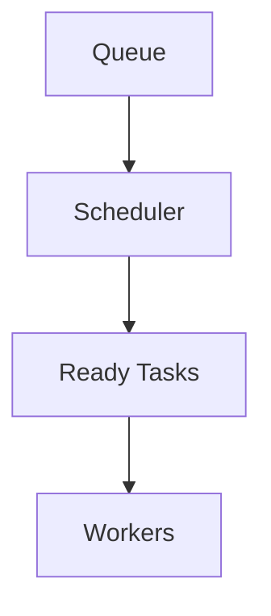

### Examples
- A compile task MAY run in parallel with a lint validation task if the dependency graph allows it.

### Future extensibility
The scheduler SHOULD support pluggable policies such as fairness, priority, or cost-aware scheduling.

### Migration impact
Any legacy scheduler MUST be replaced or wrapped to comply with the V6 state model.

### Performance considerations
Scheduling decisions SHOULD be O(1) or near-O(1) for common cases and avoid pathological contention.

### Failure handling
If a worker crashes, the scheduler MUST mark the task as failed or retryable according to policy.

### Recovery handling
The scheduler SHOULD retain enough context for rescheduling after a crash.

### Best practices
- Track attempt count and last failure reason for each job.

### Anti-patterns
- Non-deterministic scheduling based on incidental timing.

---

## 8. Pipeline Resolver Contract

### Purpose
The pipeline resolver translates a request into an executable graph of stages and engines.

### Responsibilities
- Resolve the requested pipeline definition.
- Validate input requirements.
- Select engines and dependencies.

### Allowed behavior
- The resolver MAY inspect manifests, dependencies, and configuration.
- The resolver MAY emit a normalized execution graph.

### Forbidden behavior
- The resolver MUST NOT select an engine whose manifest is incompatible with the request.
- The resolver MUST NOT ignore unresolved dependencies.

### Sequence diagram
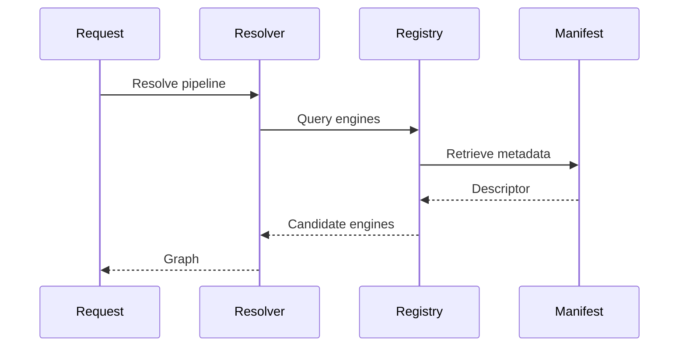

### Mermaid diagram
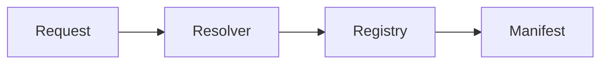

### Examples
- A request for test execution MUST resolve to the test engine manifest and any required validation stages.

### Future extensibility
The resolver SHOULD support rule-based selection and context-driven override policies.

### Migration impact
Resolver logic MUST become declarative and manifest-driven rather than hard-coded where possible.

### Performance considerations
Resolution should use cached manifests and deterministic ordering where possible.

### Failure handling
A resolution failure MUST produce a clear reason and remain traceable.

### Recovery handling
Resolver failures SHOULD allow re-attempt with corrected inputs or alternate manifests.

### Best practices
- Maintain a canonical manifest index for fast lookup.

### Anti-patterns
- Resolving pipelines by scanning the entire workspace every time.

---

## 9. Engine Registry Contract

### Purpose
The engine registry provides the authoritative inventory of known execution engines and their capabilities.

### Responsibilities
- Register engines.
- Track engine availability.
- Expose capabilities and constraints.

### Allowed behavior
- The registry MAY support registration, unregistration, and capability updates.
- The registry MAY expose health state.

### Forbidden behavior
- The registry MUST NOT register incompatible or malformed engines.
- The registry MUST NOT claim an engine is available without validation.

### Sequence diagram
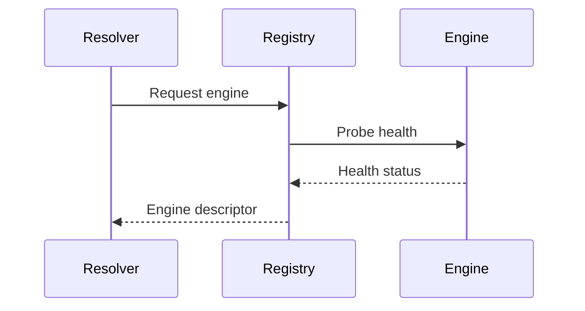

### Mermaid diagram
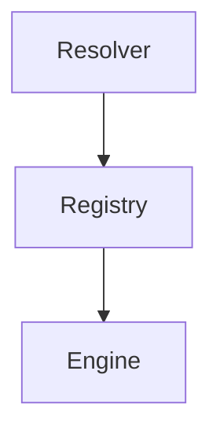

### Examples
- A build engine, test engine, and packaging engine MAY each be registered with distinct capability manifests.

### Future extensibility
The registry SHOULD support dynamic discovery from remote or plugin-managed sources.

### Migration impact
Legacy engine registration models MUST be normalized into a manifest-based registry.

### Performance considerations
Capability queries SHOULD be cached and indexed.

### Failure handling
Broken registrations MUST be isolated and flagged without causing total registry failure.

### Recovery handling
The registry SHOULD recover by reloading healthy engine descriptors after transient failure.

### Best practices
- Keep registration metadata explicit and signed where appropriate.

### Anti-patterns
- Hidden engine auto-detection without verification.

---

## 10. Engine Manifest Contract

### Purpose
The engine manifest declares the capabilities, constraints, inputs, outputs, and runtime expectations of an engine.

### Responsibilities
- Represent engine semantics.
- Define compatibility rules.
- Inform resolver and scheduler decisions.

### Allowed behavior
- A manifest MAY declare resource requirements, supported file types, and execution modes.
- A manifest MAY define retry and timeout policies.

### Forbidden behavior
- A manifest MUST NOT omit required contract fields.
- A manifest MUST NOT claim support for unsupported operations.

### Sequence diagram
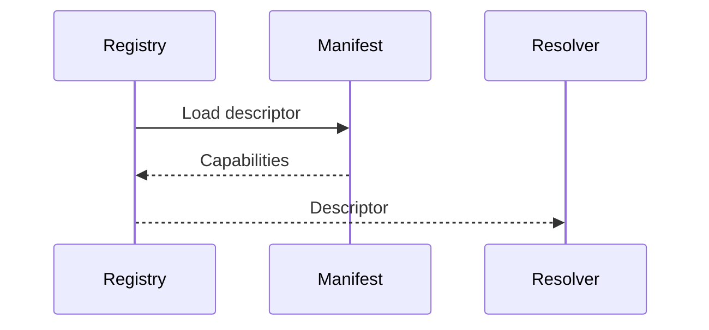

### Mermaid diagram
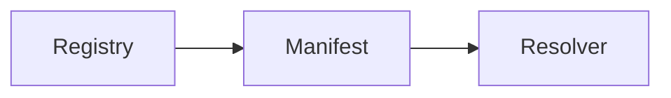

### Examples
- A compile engine manifest SHOULD declare input extension support and output artifact type.

### Future extensibility
Manifest schema SHOULD allow additive field extension without breaking older consumers.

### Migration impact
Existing engine definitions MUST be converted into the formal manifest shape.

### Performance considerations
Manifest parsing SHOULD be fast and cached.

### Failure handling
Invalid manifests MUST be rejected with clear diagnostics and cannot be used for execution.

### Recovery handling
A manifest update SHOULD be applied atomically and validated before activation.

### Best practices
- Keep manifests versioned and human-readable.

### Anti-patterns
- Unstructured or free-form engine descriptions.

---

## 11. Dependency Contract

### Purpose
The dependency contract defines how units of work declare and satisfy dependencies.

### Responsibilities
- Declare upstream requirements.
- Make dependency resolution deterministic.
- Prevent cycles and conflicting assumptions.

### Allowed behavior
- A stage MAY depend on artifact, environment, or service availability.
- Dependencies MAY be declared at compile time or runtime.

### Forbidden behavior
- Dependencies MUST NOT be implicit or hidden.
- Dependencies MUST NOT be allowed to create unresolved cycles.

### Sequence diagram
```mermaid
sequenceDiagram
    participant StageA
    participant DependencyGraph
    participant StageB
    StageA->>DependencyGraph: Declare dependency
    DependencyGraph->>StageB: Resolve prerequisite
    StageB-->>DependencyGraph: Ready
    DependencyGraph-->>StageA: Dependency satisfied
```

### Mermaid diagram
```mermaid
flowchart TD
    A[Stage A] --> B[Dependency Graph]
    B --> C[Stage B]
```

### Examples
- Compilation of a module MAY require a resolved dependency artifact produced by another stage.

### Future extensibility
Dependency types SHOULD be extensible through explicit declarations.

### Migration impact
Legacy scripts using ad hoc file assumptions MUST be brought under formal dependency declarations.

### Performance considerations
Dependency computation SHOULD be cached and incrementally updated.

### Failure handling
Missing dependencies MUST halt execution and report the missing contract.

### Recovery handling
Recovery logic SHOULD be able to re-establish dependencies from stored artifacts or manifest state.

### Best practices
- Minimize unnecessary coupling between stages.

### Anti-patterns
- Cross-stage coupling through implicit file naming conventions.

---

## 12. Artifact Contract

### Purpose
The artifact contract defines the lifecycle and semantics of build outputs, reports, logs, packages, and other deliverables.

### Responsibilities
- Define artifact identity and ownership.
- Ensure artifact integrity and traceability.
- Publish artifacts to the correct destinations.

### Allowed behavior
- An artifact MAY have metadata, content address, version, and provenance.
- An artifact MAY be immutable once published.

### Forbidden behavior
- An artifact MUST NOT be overwritten without an explicit versioning or replacement policy.
- An artifact MUST NOT be published without provenance metadata.

### Sequence diagram
```mermaid
sequenceDiagram
    participant Producer
    participant ArtifactContract
    participant ArtifactBus
    Producer->>ArtifactContract: Create artifact
    ArtifactContract->>ArtifactBus: Publish
    ArtifactBus-->>ArtifactContract: Ack
    ArtifactContract-->>Producer: Artifact ID
```

### Mermaid diagram
```mermaid
flowchart LR
    A[Producer] --> B[Artifact Contract]
    B --> C[Artifact Bus]
```

### Examples
- A test report artifact SHOULD contain execution metadata, status, output paths, and timestamps.

### Future extensibility
Artifact types SHOULD be extensible while maintaining base metadata invariants.

### Migration impact
Legacy outputs MUST be normalized into the artifact model during migration.

### Performance considerations
Artifact publication SHOULD be efficient and avoid duplicate writes.

### Failure handling
Artifact creation failures MUST be surfaced with content and sink context.

### Recovery handling
Recovery SHOULD use artifact manifests rather than re-running entire pipelines when possible.

### Best practices
- Publish artifacts only after validation succeeds.

### Anti-patterns
- Untracked file outputs produced outside the artifact lifecycle.

---

## 13. ArtifactBus Contract

### Purpose
The artifact bus manages propagation of artifact events and delivery between producers and consumers.

### Responsibilities
- Observe artifact creation and publication.
- Forward artifact events to subscribers.
- Maintain ordering where required.

### Allowed behavior
- The artifact bus MAY support publish, subscribe, and query operations.
- The artifact bus MAY buffer or replay events for a bounded window.

### Forbidden behavior
- The artifact bus MUST NOT lose events without recording a fault state.
- The artifact bus MUST NOT permit unvalidated artifact delivery.

### Sequence diagram
```mermaid
sequenceDiagram
    participant Producer
    participant ArtifactBus
    participant Consumer
    Producer->>ArtifactBus: Publish artifact
    ArtifactBus->>Consumer: Deliver event
    Consumer-->>ArtifactBus: Acknowledge
```

### Mermaid diagram
```mermaid
flowchart TD
    A[Producer] --> B[Artifact Bus]
    B --> C[Consumer]
```

### Examples
- A test engine MAY publish a report artifact and a downstream release stage MAY subscribe to it.

### Future extensibility
The bus SHOULD support multiple transport types, including in-memory, file-backed, and remote channels.

### Migration impact
The bus SHOULD provide an adapter layer for existing notification and artifact propagation mechanisms.

### Performance considerations
Event handling SHOULD avoid central bottlenecks and support bounded parallelism.

### Failure handling
Delivery failures MUST create an observable event or error state.

### Recovery handling
The bus SHOULD support replay after temporary disruption.

### Best practices
- Preserve event ordering for dependent stages.

### Anti-patterns
- Implicit event delivery without acknowledgements.

---

## 14. Caching Contract

### Purpose
The caching contract defines how intermediate and derived data are reused to improve performance and stability.

### Responsibilities
- Provide deterministic cache keys.
- Define invalidation rules.
- Ensure cache correctness.

### Allowed behavior
- A cache MAY store manifests, artifacts, dependency results, and normalized metadata.
- A cache MAY use version-aware keys.

### Forbidden behavior
- A cache MUST NOT return stale data without validation.
- A cache MUST NOT bypass artifact provenance.

### Sequence diagram
```mermaid
sequenceDiagram
    participant Caller
    participant Cache
    participant Source
    Caller->>Cache: Lookup
    alt Hit
        Cache-->>Caller: Return cached value
    else Miss
        Cache->>Source: Fetch
        Source-->>Cache: Value
        Cache-->>Caller: Return value
    end
```

### Mermaid diagram
```mermaid
flowchart LR
    A[Caller] --> B[Cache]
    B --> C[Source]
```

### Examples
- Compilation output may be cached based on source content hash and engine version.

### Future extensibility
The cache SHOULD support distributed or shared storage strategies.

### Migration impact
Legacy incremental builds MUST be translated into cacheable artifact dependencies.

### Performance considerations
Cache hit rates SHOULD be monitored and tuned per workload class.

### Failure handling
Cache corruption MUST trigger invalidation and re-computation.

### Recovery handling
The cache MUST support safe validation and rebuild.

### Best practices
- Use deterministic keys and explicit invalidation.

### Anti-patterns
- Using mutable cache entries without versioning.

---

## 15. State Machine

### Purpose
The state machine defines the allowed lifecycle states for work items, engines, artifacts, and pipelines.

### Responsibilities
- Make state transitions explicit.
- Enable recovery and observability.
- Prevent invalid transitions.

### Allowed behavior
- A work item MAY move from queued to running to completed or failed.
- A pipeline MAY be paused, resumed, or canceled under defined rules.

### Forbidden behavior
- A state transition MUST NOT be skipped without a defined rationale.
- A state MUST NOT be overwritten by an invalid event.

### Sequence diagram
```mermaid
sequenceDiagram
    participant Event
    participant StateMachine
    participant State
    Event->>StateMachine: Transition request
    StateMachine->>State: Validate
    State-->>StateMachine: Allowed
    StateMachine-->>Event: New state
```

### Mermaid diagram
```mermaid
stateDiagram-v2
    [*] --> Queued
    Queued --> Running
    Running --> Completed
    Running --> Failed
    Failed --> RetryPending
    RetryPending --> Running
    Completed --> [*]
```

### Examples
- A failed build stage MAY transition to retry pending rather than silently restarting.

### Future extensibility
New states SHOULD be introduced with explicit transitions documented in the manifest.

### Migration impact
Legacy status strings MUST be mapped to the V6 state model.

### Performance considerations
The state machine SHOULD remain lightweight and avoid excessive persistence overhead.

### Failure handling
Invalid transitions MUST be rejected with a typed state error.

### Recovery handling
The state machine SHOULD provide a replay path for interrupted workflows.

### Best practices
- Keep state transitions single-directional and explicit.

### Anti-patterns
- Implicit state derived from file presence alone.

---

## 16. Runtime Lifecycle

### Purpose
The runtime lifecycle defines the complete life of a runtime instance from initialization to teardown.

### Responsibilities
- Create runtime context.
- Bind dependencies and configuration.
- Execute work and publish terminal state.

### Allowed behavior
- A runtime MAY initialize local resources and registries.
- A runtime MAY emit lifecycle events.

### Forbidden behavior
- A runtime MUST NOT start without a defined context.
- A runtime MUST NOT continue after fatal initialization failure.

### Sequence diagram
```mermaid
sequenceDiagram
    participant Bootstrap
    participant Runtime
    participant Work
    Bootstrap->>Runtime: Initialize
    Runtime->>Work: Execute
    Work-->>Runtime: Complete
    Runtime-->>Bootstrap: Teardown
```

### Mermaid diagram
```mermaid
flowchart TD
    A[Initialize] --> B[Run]
    B --> C[Teardown]
```

### Examples
- A doctor runtime MUST initialize a workspace, diagnostics engine, and artifact sink before execution.

### Future extensibility
Lifecycle hooks SHOULD be additive and version-safe.

### Migration impact
Existing runtimes MUST adopt the V6 lifecycle contract to ensure consistent behavior.

### Performance considerations
Initialization startup SHOULD be minimized and cached when possible.

### Failure handling
Any lifecycle failure MUST produce a diagnosable exit state.

### Recovery handling
The runtime SHOULD allow restart without requiring a complete environment rebuild when possible.

### Best practices
- Separate initialization, execution, and cleanup responsibilities.

### Anti-patterns
- Performing work before runtime resources are ready.

---

## 17. Execution Lifecycle

### Purpose
The execution lifecycle defines each unit of work from invocation to completion.

### Responsibilities
- Bind execution identity.
- Track state transitions.
- Record outputs and diagnostics.

### Allowed behavior
- Execution MAY be retried based on policy.
- Execution MAY produce intermediate artifacts.

### Forbidden behavior
- Execution MUST NOT mutate unrelated state.
- Execution MUST NOT complete without emitting a terminal result.

### Sequence diagram
```mermaid
sequenceDiagram
    participant Caller
    participant Executor
    participant Worker
    Caller->>Executor: Start
    Executor->>Worker: Run
    Worker-->>Executor: Output
    Executor-->>Caller: Result
```

### Mermaid diagram
```mermaid
flowchart LR
    A[Start] --> B[Run]
    B --> C[Complete]
```

### Examples
- A compile execution MAY create an output directory and an artifact manifest.

### Future extensibility
Additional lifecycle events SHOULD be added without replacing the base model.

### Migration impact
Legacy ad hoc scripts MUST be adapted to emit the required lifecycle events.

### Performance considerations
Execution SHOULD be instrumented but not overly verbose at high frequency.

### Failure handling
Execution failure MUST preserve context, inputs, and error details.

### Recovery handling
A recoverable execution SHOULD resume from the last safe checkpoint or retry point.

### Best practices
- Emit one terminal event per execution attempt.

### Anti-patterns
- Silent failures that leave incomplete state.

---

## 18. Repair Lifecycle

### Purpose
The repair lifecycle defines how issues detected by diagnosis or validation are transformed into safe remediation actions.

### Responsibilities
- Validate repair intent.
- Apply safe changes.
- Record the changed state and provenance.

### Allowed behavior
- Repair MAY modify files, manifests, or generated outputs within a controlled scope.
- Repair MAY create a patch or repair plan artifact.

### Forbidden behavior
- Repair MUST NOT be applied without validation of safety and authorization.
- Repair MUST NOT overwrite non-owned artifacts without explicit policy.

### Sequence diagram
```mermaid
sequenceDiagram
    participant Doctor
    participant RepairLifecycle
    participant Validator
    participant Artifact
    Doctor->>RepairLifecycle: Request repair
    RepairLifecycle->>Validator: Validate change
    Validator-->>RepairLifecycle: Approved
    RepairLifecycle->>Artifact: Update
    Artifact-->>RepairLifecycle: Recorded
```

### Mermaid diagram
```mermaid
flowchart LR
    A[Diagnosis] --> B[Repair]
    B --> C[Validation]
    C --> D[Artifact Update]
```

### Examples
- A configuration repair MAY update a missing value and register the modification as a change artifact.

### Future extensibility
Repair policies SHOULD be pluggable and context-aware.

### Migration impact
Migration should preserve repair history and audit trails.

### Performance considerations
Repairs SHOULD be scoped to the minimum necessary set of changes.

### Failure handling
A failed repair MUST leave a clear trace of attempted changes and reason.

### Recovery handling
Repairs SHOULD be reversible where policy allows.

### Best practices
- Use atomic repairs and backup-safe application procedures.

### Anti-patterns
- Unchecked auto-repair without human or policy review.

---

## 19. Compile Lifecycle

### Purpose
The compile lifecycle defines how source transformations are executed, validated, and published.

### Responsibilities
- Gather source inputs.
- Execute the compile engine.
- Produce compiled outputs and diagnostics.

### Allowed behavior
- Compile MAY occur within an isolated workspace.
- Compile MAY emit intermediate and final artifacts.

### Forbidden behavior
- Compile MUST NOT produce ambiguous outputs.
- Compile MUST NOT skip diagnostics when the process fails.

### Sequence diagram
```mermaid
sequenceDiagram
    participant Request
    participant CompileLifecycle
    participant Engine
    participant Artifact
    Request->>CompileLifecycle: Compile
    CompileLifecycle->>Engine: Execute
    Engine-->>CompileLifecycle: Output
    CompileLifecycle->>Artifact: Publish
```

### Mermaid diagram
```mermaid
flowchart TD
    A[Source] --> B[Compile]
    B --> C[Artifacts]
    B --> D[Diagnostics]
```

### Examples
- A compile lifecycle MAY produce bundled assets and a metadata manifest.

### Future extensibility
The compile lifecycle SHOULD support multiple backends and toolchains.

### Migration impact
Legacy compilation steps should become first-class pipeline stages.

### Performance considerations
The compile lifecycle SHOULD reuse caches and avoid redundant work.

### Failure handling
Any compiler error MUST be captured as structured diagnostic output.

### Recovery handling
The compile lifecycle SHOULD support incremental rebuild when relevant.

### Best practices
- Treat compilation outputs as versioned artifacts.

### Anti-patterns
- Implicit compilation state stored outside the artifact contract.

---

## 20. Test Lifecycle

### Purpose
The test lifecycle defines the execution and reporting of automated quality checks.

### Responsibilities
- Run test suites.
- Capture results and evidence.
- Publish test artifacts and failure context.

### Allowed behavior
- Test execution MAY be parallelized.
- Test results MAY be grouped by module or suite.

### Forbidden behavior
- Test execution MUST NOT hide failures behind aggregate summaries.
- Test execution MUST NOT alter the source tree without explicit approval.

### Sequence diagram
```mermaid
sequenceDiagram
    participant Request
    participant TestLifecycle
    participant Runner
    participant Artifact
    Request->>TestLifecycle: Run tests
    TestLifecycle->>Runner: Execute
    Runner-->>TestLifecycle: Results
    TestLifecycle->>Artifact: Publish report
```

### Mermaid diagram
```mermaid
flowchart LR
    A[Tests] --> B[Results]
    B --> C[Report Artifact]
```

### Examples
- A unit test lifecycle SHOULD emit machine-readable results and human-readable summaries.

### Future extensibility
The lifecycle SHOULD support smoke, integration, and regression suites as separate classes.

### Migration impact
Legacy test runners MUST be converted to the standardized lifecycle contract.

### Performance considerations
Test execution SHOULD use resource-aware isolation and parallelism policies.

### Failure handling
Test failures MUST map to explicit diagnostics and errors.

### Recovery handling
The lifecycle SHOULD support retry of isolated or flaky tests under policy.

### Best practices
- Keep test reports reproducible and signed where applicable.

### Anti-patterns
- Silent test skipping without reporting.

---

## 21. Validation Lifecycle

### Purpose
The validation lifecycle defines how correctness, compliance, and quality checks are executed against outputs and intermediate states.

### Responsibilities
- Validate artifacts and configurations.
- Compare actual outputs to expected policies.
- Emit pass/fail evidence.

### Allowed behavior
- Validation MAY occur before publication or after execution.
- Validation MAY assess content, structure, compliance, and policy adherence.

### Forbidden behavior
- Validation MUST NOT be bypassed for release-critical output.
- Validation MUST NOT treat warnings as success without explicit policy.

### Sequence diagram
```mermaid
sequenceDiagram
    participant Artifact
    participant Validator
    participant Policy
    participant Report
    Artifact->>Validator: Evaluate
    Validator->>Policy: Apply rules
    Policy-->>Validator: Decision
    Validator-->>Report: Result
```

### Mermaid diagram
```mermaid
flowchart TD
    A[Artifact] --> B[Validation]
    B --> C[Policy]
    C --> D[Report]
```

### Examples
- A release artifact SHOULD be checked for required metadata and signature presence.

### Future extensibility
Validation rules SHOULD be versioned and configurable.

### Migration impact
Manual validation should be replaced or wrapped by automated validation contracts.

### Performance considerations
Validation should be incremental and avoid repeated full scans when possible.

### Failure handling
Validation failures MUST point to offending artifacts and rule identifiers.

### Recovery handling
Validation failures SHOULD support corrected input and re-validation.

### Best practices
- Treat validation as a first-class stage rather than a side effect.

### Anti-patterns
- Validation performed only after release.

---

## 22. Release Lifecycle

### Purpose
The release lifecycle defines how validated artifacts progress to publication and downstream consumption.

### Responsibilities
- Package validated artifacts.
- Version the release.
- Publish release metadata and evidence.

### Allowed behavior
- Release MAY include multiple artifacts and release notes.
- Release MAY be staged or promoted.

### Forbidden behavior
- Release MUST NOT proceed without validation success.
- Release MUST NOT publish untracked or unverified content.

### Sequence diagram
```mermaid
sequenceDiagram
    participant Validation
    participant ReleaseLifecycle
    participant Publisher
    participant Consumer
    Validation-->>ReleaseLifecycle: Approved
    ReleaseLifecycle->>Publisher: Publish
    Publisher-->>Consumer: Deliver
```

### Mermaid diagram
```mermaid
flowchart LR
    A[Validation] --> B[Release]
    B --> C[Publisher]
    C --> D[Consumer]
```

### Examples
- A release package SHOULD include a manifest, signed artifact set, and changelog references.

### Future extensibility
Release channels SHOULD be extensible for preview, stable, and emergency paths.

### Migration impact
Legacy release practices MUST be represented as structured releases with provenance.

### Performance considerations
Release publication SHOULD be idempotent and retry-safe.

### Failure handling
A failed release MUST preserve the version state and any partial outputs.

### Recovery handling
A release SHOULD be recoverable by re-running publication for the same release identity.

### Best practices
- Record all release metadata in machine-readable form.

### Anti-patterns
- Releasing without a manifest or provenance record.

---

## 23. Plugin Lifecycle

### Purpose
The plugin lifecycle defines how external capabilities are discovered, activated, and retired.

### Responsibilities
- Discover plugin manifests.
- Validate plugin compatibility.
- Activate and deactivate plugins safely.

### Allowed behavior
- Plugins MAY add engines, validators, or artifact processors.
- Plugins MAY expose metadata and optional configuration.

### Forbidden behavior
- Plugins MUST NOT bypass the engine or artifact contract.
- Plugins MUST NOT execute privileged actions without explicit policy.

### Sequence diagram
```mermaid
sequenceDiagram
    participant Host
    participant PluginLifecycle
    participant Plugin
    Host->>PluginLifecycle: Load plugin
    PluginLifecycle->>Plugin: Initialize
    Plugin-->>PluginLifecycle: Ready
    PluginLifecycle-->>Host: Registered
```

### Mermaid diagram
```mermaid
flowchart TD
    A[Host] --> B[Plugin Lifecycle]
    B --> C[Plugin]
```

### Examples
- A custom validator plugin MAY be installed to enforce domain-specific checks.

### Future extensibility
The plugin model SHOULD support versioned interfaces and compatibility checks.

### Migration impact
Legacy extensions MUST be adapted to the plugin manifest and lifecycle rules.

### Performance considerations
Plugin loading SHOULD be bounded and isolated to avoid excessive overhead.

### Failure handling
Plugin load failure MUST be isolated and logged without destabilizing the host runtime.

### Recovery handling
A failed plugin SHOULD be unloaded and retried under policy.

### Best practices
- Keep plugins self-describing and versioned.

### Anti-patterns
- Plugins that mutate host global state without declaration.

---

## 24. Recovery Lifecycle

### Purpose
The recovery lifecycle defines how the system restores itself after partial failures, crashes, or interrupted execution.

### Responsibilities
- Detect failure domains.
- Preserve recoverable state.
- Rebuild or resume work safely.

### Allowed behavior
- Recovery MAY resume within a stage boundary.
- Recovery MAY rebuild from artifact or cache state.

### Forbidden behavior
- Recovery MUST NOT silently ignore data loss or corruption.
- Recovery MUST NOT cause duplicate work without deduplication.

### Sequence diagram
```mermaid
sequenceDiagram
    participant Failure
    participant Recovery
    participant StateStore
    participant Executor
    Failure->>Recovery: Detect issue
    Recovery->>StateStore: Load state
    StateStore-->>Recovery: Snapshot
    Recovery->>Executor: Resume or rebuild
```

### Mermaid diagram
```mermaid
flowchart LR
    A[Failure] --> B[Recovery]
    B --> C[State Store]
    C --> D[Resume]
```

### Examples
- After an interrupted compile, recovery SHOULD resume from the last known successful stage.

### Future extensibility
Recovery policies SHOULD be configurable by pipeline, engine, or environment.

### Migration impact
Legacy failure handling MUST be mapped into the recovery lifecycle and state transitions.

### Performance considerations
Recovery SHOULD avoid expensive full re-execution when a checkpoint is available.

### Failure handling
Recovery failures MUST lead to explicit diagnostic reporting and a non-success terminal state.

### Recovery handling
Recovery itself MUST be idempotent where possible.

### Best practices
- Persist state transitions and checkpoints with strong identifiers.

### Anti-patterns
- Recovery purely by rerunning all work without checkpoint awareness.

---

## 25. Error Contract

### Purpose
The error contract defines how failures are represented and propagated.

### Responsibilities
- Provide consistent error structure.
- Preserve context and classification.
- Support machine processing and human presentation.

### Allowed behavior
- An error MAY include type, code, message, stage, request ID, and remediation hints.
- An error MAY be recoverable or terminal.

### Forbidden behavior
- Errors MUST NOT be represented as unstructured strings alone.
- Errors MUST NOT lose the failing component context.

### Sequence diagram
```mermaid
sequenceDiagram
    participant Component
    participant ErrorContract
    participant Logger
    Component->>ErrorContract: Raise error
    ErrorContract->>Logger: Emit diagnostic
    Logger-->>Component: Recorded
```

### Mermaid diagram
```mermaid
flowchart TD
    A[Component] --> B[Error Contract]
    B --> C[Logger]
```

### Examples
- A missing dependency error SHOULD include the missing artifact and the stage that required it.

### Future extensibility
Error types SHOULD support domain extensions and remediation metadata.

### Migration impact
Legacy errors MUST be normalized to the V6 error model.

### Performance considerations
Error construction MUST be lightweight and avoid excessive stack processing during normal execution.

### Failure handling
Any unexpected exception MUST be transformed into the error contract before propagation.

### Recovery handling
Recoverable errors MUST carry enough context for retries or fallback.

### Best practices
- Include both machine-readable and human-readable details.

### Anti-patterns
- Returning vague or untyped exception messages.

---

## 26. Logging Contract

### Purpose
The logging contract defines how operational and diagnostic information is emitted and consumed.

### Responsibilities
- Capture lifecycle, execution, and error events.
- Preserve correlation identifiers.
- Support structured logs.

### Allowed behavior
- Logs MAY be emitted at trace, debug, info, warning, error, and fatal levels.
- Logs MAY include request context and runtime metadata.

### Forbidden behavior
- Logs MUST NOT contain secrets or sensitive runtime inputs unless explicitly permitted.
- Logs MUST NOT be emitted without correlation identifiers.

### Sequence diagram
```mermaid
sequenceDiagram
    participant Component
    participant Logger
    participant Sink
    Component->>Logger: Emit event
    Logger->>Sink: Persist or stream
```

### Mermaid diagram
```mermaid
flowchart LR
    A[Component] --> B[Logger]
    B --> C[Sink]
```

### Examples
- Scheduler events SHOULD include execution ID, attempt number, and stage identifier.

### Future extensibility
Log sinks SHOULD be pluggable and support rotation, buffering, and remote delivery.

### Migration impact
Older ad hoc logging MUST be moved to the structured contract.

### Performance considerations
Logging SHOULD be asynchronous or buffered where appropriate to avoid blocking execution.

### Failure handling
Logger failure MUST not crash the primary runtime path; it must degrade gracefully.

### Recovery handling
Logs SHOULD be recoverable and should not block the main execution path during temporary sink failures.

### Best practices
- Emit structured records with consistent fields.

### Anti-patterns
- Logging raw secrets or large unbounded payloads.

---

## 27. Metrics Contract

### Purpose
The metrics contract defines how observable performance and health data is captured.

### Responsibilities
- Track counts, duration, throughput, and error rates.
- Support monitoring and trend analysis.
- Feed dashboards and alerting systems.

### Allowed behavior
- Metrics MAY be emitted as counters, gauges, histograms, and summaries.
- Metrics MAY be aggregated over time windows.

### Forbidden behavior
- Metrics MUST NOT be collected in a non-deterministic way that makes them unusable for trend analysis.
- Metrics MUST NOT omit the identity of the emitting component.

### Sequence diagram
```mermaid
sequenceDiagram
    participant Component
    participant Metrics
    participant Collector
    Component->>Metrics: Record metric
    Metrics->>Collector: Aggregate
```

### Mermaid diagram
```mermaid
flowchart LR
    A[Component] --> B[Metrics]
    B --> C[Collector]
```

### Examples
- A scheduler SHOULD record queue depth and dispatch latency.

### Future extensibility
Metrics backends SHOULD be swappable without changing instrumentation semantics.

### Migration impact
Legacy metrics MUST be mapped to the standardized metric names and dimensions.

### Performance considerations
Metric emission SHOULD be low overhead and avoid full serialization in hot paths when possible.

### Failure handling
Metrics failures MUST not break core execution.

### Recovery handling
Metric state SHOULD be recoverable and reinitialized safely.

### Best practices
- Record both success and failure counters.

### Anti-patterns
- Collecting metrics without labels or dimensions.

---

## 28. Performance Contract

### Purpose
The performance contract sets expectations for runtime efficiency, overhead control, and scalability.

### Responsibilities
- Keep execution overhead bounded.
- Ensure scheduling and resolution remain efficient at scale.
- Define acceptable operational limits.

### Allowed behavior
- The architecture MAY use caching, batching, and concurrency to improve throughput.
- The architecture MAY expose performance budgets per stage.

### Forbidden behavior
- Performance optimizations MUST NOT compromise correctness or auditability.
- Performance MUST NOT be achieved through hidden nondeterminism.

### Sequence diagram
```mermaid
sequenceDiagram
    participant Monitor
    participant Runtime
    participant Benchmark
    Monitor->>Runtime: Measure
    Runtime->>Benchmark: Collect data
    Benchmark-->>Monitor: Report
```

### Mermaid diagram
```mermaid
flowchart TD
    A[Runtime] --> B[Monitor]
    B --> C[Benchmark]
```

### Examples
- A pipeline SHOULD expose a maximum acceptable runtime for each stage.

### Future extensibility
Performance budgets SHOULD be configurable per workload class.

### Migration impact
Performance expectations MUST be explicitly documented during migration.

### Performance considerations
Hot paths SHOULD be profiled and minimized.

### Failure handling
Performance degradation SHOULD trigger diagnostics and alerting.

### Recovery handling
Recovery SHOULD avoid compounding performance issues by limiting concurrent retries.

### Best practices
- Measure performance with representative workloads.

### Anti-patterns
- Optimizing without instrumentation.

---

## 29. Concurrency Contract

### Purpose
The concurrency contract defines how independent work is safely parallelized.

### Responsibilities
- Avoid race conditions.
- Preserve ordering where required.
- Bound resource contention.

### Allowed behavior
- Independent stages MAY run concurrently.
- Shared resources MAY be protected by explicit locking or serialization rules.

### Forbidden behavior
- Concurrent executions MUST NOT mutate shared state without synchronization.
- Concurrency MUST NOT allow nondeterministic side effects.

### Sequence diagram
```mermaid
sequenceDiagram
    participant Scheduler
    participant WorkerA
    participant WorkerB
    Scheduler->>WorkerA: Dispatch
    Scheduler->>WorkerB: Dispatch
    WorkerA-->>Scheduler: Result A
    WorkerB-->>Scheduler: Result B
```

### Mermaid diagram
```mermaid
flowchart LR
    A[Scheduler] --> B[Worker A]
    A --> C[Worker B]
```

### Examples
- Two independent test suites MAY run in parallel if they use separate output directories.

### Future extensibility
The concurrency policy SHOULD be configurable by workload and resource profile.

### Migration impact
Legacy serial workflows should be refactored into safe parallel branches only when dependencies allow it.

### Performance considerations
Concurrency SHOULD be capped to avoid oversubscription.

### Failure handling
A partial failure in one branch MUST not corrupt the rest of the execution graph.

### Recovery handling
Recovery logic MUST handle partial completion and restart safely.

### Best practices
- Use isolated workspaces and explicit dependency boundaries.

### Anti-patterns
- Parallelism with shared mutable state and no coordination.

---

## 30. Parallel Execution Contract

### Purpose
The parallel execution contract defines how parallel branches are coordinated and merged.

### Responsibilities
- Schedule branch execution.
- Reconcile partial results.
- Apply join semantics.

### Allowed behavior
- Parallel branches MAY be joined after all dependencies complete.
- Branches MAY be canceled if upstream conditions change.

### Forbidden behavior
- Parallel branches MUST NOT omit a merge point when downstream work depends on them.
- Parallel branches MUST NOT race on the same artifact sink without coordination.

### Sequence diagram
```mermaid
sequenceDiagram
    participant Scheduler
    participant BranchA
    participant BranchB
    participant Join
    Scheduler->>BranchA: Run
    Scheduler->>BranchB: Run
    BranchA-->>Join: Result
    BranchB-->>Join: Result
    Join-->>Scheduler: Aggregated
```

### Mermaid diagram
```mermaid
flowchart TD
    A[Branch A] --> C[Join]
    B[Branch B] --> C
```

### Examples
- Validation and packaging MAY run in parallel and join before release.

### Future extensibility
The join model SHOULD support fan-in and fan-out patterns without custom code changes.

### Migration impact
Legacy sequential workflows SHOULD be decomposed into explicit branch and join points.

### Performance considerations
Parallelism SHOULD be tuned to available execution capacity.

### Failure handling
A branch failure MUST be visible to the join point and should influence downstream behavior.

### Recovery handling
Interrupted parallel work SHOULD be resumed from branch-level checkpoints.

### Best practices
- Make join semantics explicit and deterministic.

### Anti-patterns
- Implicit branch merge without documented semantics.

---

## 31. Memory Contract

### Purpose
The memory contract defines how runtime state, artifacts, and intermediate data are handled within resource constraints.

### Responsibilities
- Limit memory footprint.
- Avoid leaks.
- Preserve recoverability.

### Allowed behavior
- Intermediate results MAY be streamed or stored on disk when memory is constrained.
- Memory usage MAY be monitored and bounded.

### Forbidden behavior
- Memory MUST NOT be consumed without tracking or cleanup.
- Memory MUST NOT be used to hide incomplete state.

### Sequence diagram
```mermaid
sequenceDiagram
    participant Runtime
    participant MemoryManager
    participant Resource
    Runtime->>MemoryManager: Allocate
    MemoryManager->>Resource: Reserve
    Runtime-->>MemoryManager: Release
```

### Mermaid diagram
```mermaid
flowchart LR
    A[Runtime] --> B[Memory Manager]
    B --> C[Resource]
```

### Examples
- Large build outputs SHOULD be streamed to artifact storage instead of retained in process memory.

### Future extensibility
Memory policies SHOULD support tiered storage and compression strategies.

### Migration impact
Legacy implementations SHOULD adopt explicit lifecycle cleanup and bounded buffers.

### Performance considerations
Memory pressure SHOULD trigger controlled degradation instead of uncontrolled failure.

### Failure handling
Out-of-memory conditions MUST produce deterministic errors and cleanup.

### Recovery handling
The runtime SHOULD be able to recover after memory pressure by releasing temporary state.

### Best practices
- Release temporary buffers promptly.

### Anti-patterns
- Retaining large objects indefinitely after use.

---

## 32. Security Contract

### Purpose
The security contract defines how the system protects integrity, access, and confidentiality of executions and artifacts.

### Responsibilities
- Control access to runtime operations.
- Protect credentials and secrets.
- Ensure artifact integrity and trust.

### Allowed behavior
- The system MAY authenticate requests and authorize operations.
- The system MAY sign artifacts and validate provenance.

### Forbidden behavior
- Security-sensitive data MUST NOT be logged or exposed without policy approval.
- The system MUST NOT trust unsigned or unvalidated artifacts.

### Sequence diagram
```mermaid
sequenceDiagram
    participant Caller
    participant SecurityLayer
    participant Runtime
    Caller->>SecurityLayer: Authenticate
    SecurityLayer->>Runtime: Authorized request
```

### Mermaid diagram
```mermaid
flowchart LR
    A[Caller] --> B[Security Layer]
    B --> C[Runtime]
```

### Examples
- A release artifact MAY require signature validation before publication.

### Future extensibility
The security model SHOULD support policy-based authorization and secret rotation.

### Migration impact
Legacy trust assumptions MUST be replaced with explicit authentication and verification.

### Performance considerations
Security checks MUST remain efficient and avoid excessive overhead.

### Failure handling
Security validation failures MUST stop execution and report a clear policy violation.

### Recovery handling
Recovery paths SHOULD avoid bypassing security checks.

### Best practices
- Separate authentication, authorization, and validation concerns.

### Anti-patterns
- Trusting local state without verification.

---

## 33. Versioning Contract

### Purpose
The versioning contract defines how versions are assigned, interpreted, and validated across manifests, engines, artifacts, and releases.

### Responsibilities
- Express compatibility and evolution.
- Avoid ambiguity across components.
- Support migration and rollback.

### Allowed behavior
- Components MAY have semantic or schema versions.
- Versions MAY be compared for compatibility.

### Forbidden behavior
- Versions MUST NOT be ambiguous or non-deterministic.
- Version changes MUST NOT silently break compatibility without documented migration.

### Sequence diagram
```mermaid
sequenceDiagram
    participant Client
    participant Versioning
    participant Component
    Client->>Versioning: Request version
    Versioning->>Component: Resolve compatibility
    Component-->>Versioning: Version info
```

### Mermaid diagram
```mermaid
flowchart LR
    A[Client] --> B[Versioning]
    B --> C[Component]
```

### Examples
- An engine manifest version SHOULD be compared against the runtime contract version before activation.

### Future extensibility
Versioning rules SHOULD allow additive upgrades while preserving backward compatibility.

### Migration impact
Older versions MUST be mapped to the new semantics during migration.

### Performance considerations
Version comparison SHOULD be lightweight and deterministic.

### Failure handling
Incompatible versions MUST be rejected.

### Recovery handling
Compatible rollback paths SHOULD remain available when required.

### Best practices
- Use explicit version ranges and compatibility declarations.

### Anti-patterns
- Implicit version assumptions based on the current environment.

---

## 34. Backward Compatibility Contract

### Purpose
The backward compatibility contract ensures that older users and integrations can continue to function when the architecture evolves.

### Responsibilities
- Preserve stable interfaces where feasible.
- Provide migration paths for incompatible changes.
- Document behavioral deltas.

### Allowed behavior
- Additive changes MAY be introduced without breaking existing callers.
- Deprecated interfaces MAY remain temporarily supported.

### Forbidden behavior
- Breaking changes MUST NOT be introduced without a documented migration plan and compatibility window.
- The architecture MUST NOT silently change semantics without versioning.

### Sequence diagram
```mermaid
sequenceDiagram
    participant Client
    participant CompatibilityLayer
    participant NewRuntime
    Client->>CompatibilityLayer: Legacy request
    CompatibilityLayer->>NewRuntime: Translate
    NewRuntime-->>CompatibilityLayer: Response
```

### Mermaid diagram
```mermaid
flowchart LR
    A[Legacy Client] --> B[Compatibility Layer]
    B --> C[New Runtime]
```

### Examples
- A deprecated CLI argument MAY continue to work while new equivalents are introduced.

### Future extensibility
Compatibility handling SHOULD be structured and central rather than duplicated across components.

### Migration impact
Any behavioral change MUST be measured against the compatibility contract.

### Performance considerations
Compatibility translation SHOULD be minimal and avoid repeated expensive conversions.

### Failure handling
Incompatible legacy requests MUST be converted into explicit error types rather than implicit failures.

### Recovery handling
Compatibility layers SHOULD preserve recoverability for retries and failed translation.

### Best practices
- Maintain a compatibility matrix for major interfaces.

### Anti-patterns
- Removing old interfaces without a transition period.

---

## 35. Migration Contract

### Purpose
The migration contract defines how existing systems are transformed into V6-compliant implementations.

### Responsibilities
- Preserve business intent.
- Minimize disruption.
- Provide clear sequencing and rollback points.

### Allowed behavior
- Migration MAY proceed incrementally by subsystem or capability.
- Migration MAY use adapters or compatibility layers.

### Forbidden behavior
- Migration MUST NOT rely on destructive replacement without rollback capability.
- Migration MUST NOT ignore existing operational constraints.

### Sequence diagram
```mermaid
sequenceDiagram
    participant LegacySystem
    participant MigrationTool
    participant TargetSystem
    LegacySystem->>MigrationTool: Export state
    MigrationTool->>TargetSystem: Import state
    TargetSystem-->>MigrationTool: Validation
```

### Mermaid diagram
```mermaid
flowchart LR
    A[Legacy] --> B[Migration]
    B --> C[Target]
```

### Examples
- A legacy build script SHOULD be translated into a pipeline definition and manifests during migration.

### Future extensibility
Migration tooling SHOULD be reusable across environments and domains.

### Migration impact
Migration MUST be tracked as a first-class lifecycle with validation and rollback criteria.

### Performance considerations
Migration operations SHOULD be performed in batches and with checkpointing where needed.

### Failure handling
Migration failure MUST preserve the source state and produce detailed diagnostics.

### Recovery handling
Migration MUST support rollback to the last known good state.

### Best practices
- Validate intermediate results before proceeding to the next migration stage.

### Anti-patterns
- Big-bang migration without checkpoints or validation.

---

## 36. Folder Convention

### Purpose
The folder convention defines the required arrangement of repository content for clarity and predictability.

### Responsibilities
- Organize runtime, configuration, documentation, and artifact data consistently.
- Make responsibilities visible from the file layout.

### Allowed behavior
- Folders MAY correspond to runtime domains, artifacts, or lifecycle concerns.
- Folders MAY contain supporting metadata and manifests.

### Forbidden behavior
- Folders MUST NOT be used to hide cross-cutting concerns or duplicate responsibilities.
- Folders MUST NOT contain unstructured or ad hoc content without a defined purpose.

### Sequence diagram
```mermaid
sequenceDiagram
    participant Developer
    participant FolderConvention
    participant Workspace
    Developer->>FolderConvention: Create structure
    FolderConvention->>Workspace: Organize content
```

### Mermaid diagram
```mermaid
flowchart TD
    A[Root] --> B[Runtime]
    A --> C[Artifacts]
    A --> D[Docs]
```

### Examples
- A workspace SHOULD contain explicit directories for runtime, configuration, tests, artifacts, and documentation.

### Future extensibility
Folder conventions SHOULD accommodate new subsystems without breaking the top-level structure.

### Migration impact
Legacy folders MUST be normalized to these conventions over time.

### Performance considerations
The folder structure SHOULD support fast discovery and simple path-based operations.

### Failure handling
Misplaced files SHOULD be detected by validation rules and surfaced as a structural issue.

### Recovery handling
Folder recovery SHOULD be via relocation and re-indexing rather than manual duplication.

### Best practices
- Keep the top-level layout simple and consistent.

### Anti-patterns
- Scattering runtime artifacts across unrelated directories.

---

## 37. File Convention

### Purpose
The file convention defines how repository files are named and grouped to maintain consistency.

### Responsibilities
- Preserve readability and discoverability.
- Avoid ambiguous file usage.

### Allowed behavior
- Files MAY carry specific suffixes to indicate role, such as manifest, log, report, or artifact.
- Files MAY be organized into versioned or lifecycle-specific folders.

### Forbidden behavior
- Files MUST NOT be named inconsistently across the same subsystem.
- Files MUST NOT mix contract data with operational runtime data without clear separation.

### Sequence diagram
```mermaid
sequenceDiagram
    participant Author
    participant FileConvention
    participant Repository
    Author->>FileConvention: Create file
    FileConvention->>Repository: Place and name consistently
```

### Mermaid diagram
```mermaid
flowchart LR
    A[Author] --> B[File Convention]
    B --> C[Repository]
```

### Examples
- A manifest file SHOULD use a stable naming pattern and a recognized extension.

### Future extensibility
File conventions SHOULD allow new artifact types through additive patterns.

### Migration impact
Legacy files SHOULD be remapped into the new naming model during migration.

### Performance considerations
File naming SHOULD avoid redundant nesting and deep path complexity.

### Failure handling
Misnamed files SHOULD be detected through validation.

### Recovery handling
Files SHOULD be recoverable from manifests and provenance records.

### Best practices
- Keep names descriptive and stable.

### Anti-patterns
- Arbitrary names that obscure purpose.

---

## 38. Naming Convention

### Purpose
The naming convention ensures that components, files, states, and artifacts can be understood and searched efficiently.

### Responsibilities
- Promote clarity and consistency.
- Support automated scanning and tooling.

### Allowed behavior
- Names MAY use lowercase, kebab-case, or snake_case subject to the specification.
- Names SHOULD be descriptive and stable.

### Forbidden behavior
- Names MUST NOT be ambiguous or overloaded.
- Names MUST NOT use random or non-deterministic identifiers for core contracts.

### Sequence diagram
```mermaid
sequenceDiagram
    participant Author
    participant NamingConvention
    participant Catalog
    Author->>NamingConvention: Name artifact
    NamingConvention->>Catalog: Register name
```

### Mermaid diagram
```mermaid
flowchart LR
    A[Author] --> B[Naming Convention]
    B --> C[Catalog]
```

### Examples
- A pipeline stage SHOULD be named using a domain-specific and stable identifier.

### Future extensibility
Naming rules SHOULD allow domain-specific prefixes where necessary.

### Migration impact
Legacy names SHOULD be normalized through a translation layer when required.

### Performance considerations
Naming conventions SHOULD avoid long and costly identifiers where compactness is acceptable.

### Failure handling
Ambiguous naming MUST create a validation issue.

### Recovery handling
Rename operations SHOULD be tracked and reversible.

### Best practices
- Keep names aligned with the contract they represent.

### Anti-patterns
- Names that change frequently without governance.

---

## 39. Coding Convention

### Purpose
The coding convention ensures that implementations are readable, maintainable, and consistent across the architecture.

### Responsibilities
- Define structure, style, and implementation expectations.
- Keep logic understandable and auditable.

### Allowed behavior
- Implementations MAY use explicit errors, typed data structures, and modular decomposition.
- Implementations SHOULD favor clarity over cleverness.

### Forbidden behavior
- Implementations MUST NOT rely on hidden side effects or global state for correctness.
- Implementations MUST NOT duplicate logic when a shared abstraction exists.

### Sequence diagram
```mermaid
sequenceDiagram
    participant Developer
    participant Convention
    participant Codebase
    Developer->>Convention: Implement feature
    Convention->>Codebase: Guide structure
```

### Mermaid diagram
```mermaid
flowchart LR
    A[Developer] --> B[Coding Convention]
    B --> C[Codebase]
```

### Examples
- A contract implementation SHOULD expose clear entry points and deterministic error handling.

### Future extensibility
The conventions SHOULD be extended by domain-specific guidelines when needed.

### Migration impact
Existing code should be adapted incrementally to these conventions.

### Performance considerations
Code conventions SHOULD not encourage unnecessary abstraction overhead.

### Failure handling
Violations SHOULD be caught during review or validation.

### Recovery handling
Refactoring SHOULD preserve behavior and traceability.

### Best practices
- Keep functions single-purpose and composable.

### Anti-patterns
- Deeply nested, poorly documented, and non-modular code.

---

## 40. Documentation Convention

### Purpose
The documentation convention ensures the architecture remains understandable by implementers, operators, and reviewers.

### Responsibilities
- Document contracts, lifecycles, and conventions.
- Prevent drift between implementation and specification.

### Allowed behavior
- Documentation MAY be in markdown, JSON, or structured machine-readable formats.
- Documentation SHOULD be synchronized with the implementation and runtime behavior.

### Forbidden behavior
- Documentation MUST NOT contradict the normative specification.
- Documentation MUST NOT describe behavior that the implementation does not honor.

### Sequence diagram
```mermaid
sequenceDiagram
    participant Author
    participant Documentation
    participant Consumer
    Author->>Documentation: Write spec
    Documentation-->>Consumer: Inform implementation
```

### Mermaid diagram
```mermaid
flowchart LR
    A[Author] --> B[Documentation]
    B --> C[Consumer]
```

### Examples
- Each contract SHOULD have a corresponding documentation entry describing purpose, responsibilities, and invariants.

### Future extensibility
Documentation SHOULD support versioned references and change history.

### Migration impact
Legacy documentation MUST be reconciled with this authoritative specification.

### Performance considerations
Documentation overhead SHOULD not impede execution workflows.

### Failure handling
Missing or outdated documentation SHOULD lead to review findings.

### Recovery handling
Documentation updates SHOULD be reversible and traceable.

### Best practices
- Keep documentation close to the artifacts it describes.

### Anti-patterns
- Documentation that is stale or not referenced.

---

## 41. JSON Convention

### Purpose
The JSON convention defines the structure and semantics of machine-readable configuration and contract data.

### Responsibilities
- Provide consistent and inspectable schema structures.
- Enable tooling and validation.

### Allowed behavior
- JSON MAY be used for manifests, logs, and configuration payloads.
- JSON SHOULD be deterministic and well-formed.

### Forbidden behavior
- JSON MUST NOT be used to encode ambiguous or non-standard data without schema guidance.
- JSON MUST NOT contain duplicate keys or inconsistent types.

### Sequence diagram
```mermaid
sequenceDiagram
    participant Producer
    participant JSONConvention
    participant Consumer
    Producer->>JSONConvention: Emit payload
    JSONConvention->>Consumer: Parse and validate
```

### Mermaid diagram
```mermaid
flowchart LR
    A[Producer] --> B[JSON Convention]
    B --> C[Consumer]
```

### Examples
- A manifest SHOULD include a schema version, type, metadata, and dependencies.

### Future extensibility
JSON structures SHOULD support incrementally adding fields while preserving backward compatibility.

### Migration impact
Legacy JSON payloads MUST be normalized to the V6 schema.

### Performance considerations
JSON SHOULD remain compact and avoid unreadable nesting.

### Failure handling
Invalid JSON MUST be rejected and reported with a precise location where possible.

### Recovery handling
A malformed payload SHOULD not cause broader runtime failure if it can be quarantined.

### Best practices
- Use explicit field names and avoid overloaded objects.

### Anti-patterns
- Free-form JSON without schema or validation.

---

## 42. Configuration Convention

### Purpose
The configuration convention defines how environment, runtime, and pipeline settings are represented and interpreted.

### Responsibilities
- Centralize configuration semantics.
- Provide overrides and defaults.
- Ensure validation before execution.

### Allowed behavior
- Configuration MAY be sourced from files, environment variables, or explicit runtime parameters.
- Configuration MAY have precedence rules.

### Forbidden behavior
- Configuration MUST NOT contain hidden side effects.
- Configuration MUST NOT be scattered without a canonical source.

### Sequence diagram
```mermaid
sequenceDiagram
    participant Runtime
    participant ConfigProvider
    participant Validator
    Runtime->>ConfigProvider: Request config
    ConfigProvider->>Validator: Validate
    Validator-->>Runtime: Resolved config
```

### Mermaid diagram
```mermaid
flowchart LR
    A[Runtime] --> B[Config Provider]
    B --> C[Validator]
```

### Examples
- A pipeline config SHOULD declare resource limits, retries, and artifact targets.

### Future extensibility
The configuration model SHOULD permit environment-specific overlays.

### Migration impact
Existing config files MUST be mapped into the canonical model.

### Performance considerations
Config resolution SHOULD be inexpensive and cached.

### Failure handling
Invalid configuration MUST stop execution with a precise error.

### Recovery handling
Configuration changes SHOULD be applied through a controlled reload path.

### Best practices
- Separate defaults, environment overrides, and runtime overrides.

### Anti-patterns
- Hard-coded values scattered throughout the system.

---

## 43. Environment Convention

### Purpose
The environment convention defines how execution environments are represented and controlled.

### Responsibilities
- Make environments explicit and reproducible.
- Isolate runtime dependencies.
- Support testing and deployment contexts.

### Allowed behavior
- Environments MAY be development, staging, production, or ephemeral test contexts.
- Environments MAY declare required tools and versions.

### Forbidden behavior
- Environments MUST NOT rely on undocumented host assumptions.
- Environments MUST NOT share mutable state across contexts without explicit policy.

### Sequence diagram
```mermaid
sequenceDiagram
    participant Runtime
    participant Environment
    participant DependencySet
    Runtime->>Environment: Resolve environment
    Environment->>DependencySet: Load expected tools
```

### Mermaid diagram
```mermaid
flowchart LR
    A[Runtime] --> B[Environment]
    B --> C[Dependencies]
```

### Examples
- A build environment SHOULD declare toolchain versions and path expectations.

### Future extensibility
Environment profiles SHOULD be extendable for new deployment targets.

### Migration impact
Legacy runtime environments MUST be translated into explicit environment descriptors.

### Performance considerations
Environment bootstrapping SHOULD be efficient and cached where feasible.

### Failure handling
Missing or incompatible environments MUST halt execution with a clear diagnostic.

### Recovery handling
Environment recovery SHOULD reinitialize from the declared profile rather than rely on host state.

### Best practices
- Keep environment definitions declarative and versioned.

### Anti-patterns
- Assuming the host machine already satisfies runtime requirements.

---

## 44. CLI Convention

### Purpose
The CLI convention defines how users and automation interact with the architecture through a command-line surface.

### Responsibilities
- Provide stable command structure.
- Map CLI actions to runtime operations.
- Expose predictable output and exit semantics.

### Allowed behavior
- A CLI MAY accept commands, options, and configuration files.
- A CLI MAY emit structured and human-readable output.

### Forbidden behavior
- The CLI MUST NOT bypass the runtime contract.
- The CLI MUST NOT expose hidden side effects not documented in the command semantics.

### Sequence diagram
```mermaid
sequenceDiagram
    participant User
    participant CLI
    participant Runtime
    User->>CLI: Invoke command
    CLI->>Runtime: Execute action
    Runtime-->>CLI: Result
```

### Mermaid diagram
```mermaid
flowchart LR
    A[User] --> B[CLI]
    B --> C[Runtime]
```

### Examples
- A CLI command SHOULD be mapped to a pipeline or lifecycle action with explicit arguments.

### Future extensibility
The CLI SHOULD support subcommands and plugin-based extensions.

### Migration impact
Legacy CLI behavior MUST be mapped to the new command structure without silent change.

### Performance considerations
CLI latency SHOULD be low and predictable.

### Failure handling
CLI failures MUST return non-zero exit codes and structured diagnostics.

### Recovery handling
The CLI SHOULD allow re-run after a failed operation with preserved context where possible.

### Best practices
- Keep commands consistent and discoverable.

### Anti-patterns
- Unstable, undocumented, or overloaded commands.

---

## 45. API Convention

### Purpose
The API convention defines how services and components expose interfaces and exchange structured requests.

### Responsibilities
- Define request and response shapes.
- Maintain versioned and discoverable interfaces.
- Preserve error semantics.

### Allowed behavior
- APIs MAY use request/response, event, or streaming patterns.
- APIs SHOULD enforce schema and input validation.

### Forbidden behavior
- APIs MUST NOT accept ambiguous input without validation.
- APIs MUST NOT silently ignore invalid fields.

### Sequence diagram
```mermaid
sequenceDiagram
    participant Client
    participant API
    participant Service
    Client->>API: Request
    API->>Service: Dispatch
    Service-->>API: Response
    API-->>Client: Envelope
```

### Mermaid diagram
```mermaid
flowchart LR
    A[Client] --> B[API]
    B --> C[Service]
```

### Examples
- A runtime API SHOULD return a structured outcome that includes status, trace ID, and artifacts.

### Future extensibility
API versions SHOULD be additive and backward compatible where possible.

### Migration impact
Legacy endpoint semantics MUST be adapted to the new envelope and versioning model.

### Performance considerations
API calls SHOULD avoid unnecessary round trips and preserve bounded payload size.

### Failure handling
API errors MUST be returned as structured errors with classification.

### Recovery handling
Transient failures SHOULD be retried using explicit policy rather than blind retries.

### Best practices
- Keep request and response schemas explicit and versioned.

### Anti-patterns
- Overly permissive APIs that accept arbitrary objects without validation.

---

## 46. Module Convention

### Purpose
The module convention defines how implementation units are separated and composed.

### Responsibilities
- Group related responsibilities.
- Preserve loose coupling.
- Support import and dependency management.

### Allowed behavior
- A module MAY expose a public contract and hide internal implementation details.
- A module MAY depend on other modules through explicit interfaces.

### Forbidden behavior
- Modules MUST NOT share hidden mutable state that bypasses contracts.
- Modules MUST NOT become indistinguishable from the runtime itself.

### Sequence diagram
```mermaid
sequenceDiagram
    participant ModuleA
    participant ModuleB
    ModuleA->>ModuleB: Request capability
    ModuleB-->>ModuleA: Result
```

### Mermaid diagram
```mermaid
flowchart LR
    A[Module A] --> B[Module B]
```

### Examples
- A resolver module SHOULD not contain scheduler logic beyond the contract it serves.

### Future extensibility
Modules SHOULD be able to be replaced or extended without requiring a full system rewrite.

### Migration impact
Legacy modules MUST be split according to responsibility boundaries.

### Performance considerations
Module boundaries SHOULD remain lightweight and avoid excessive marshaling.

### Failure handling
Module failure MUST be isolated and reported with scope.

### Recovery handling
A failing module SHOULD be recoverable through reset, reload, or restart.

### Best practices
- Keep modules cohesive and clearly named.

### Anti-patterns
- God modules that implement unrelated responsibilities.

---

## 47. Package Convention

### Purpose
The package convention defines how distributable units are organized and referenced.

### Responsibilities
- Encapsulate reusable components.
- Define dependency boundaries.
- Support installation and distribution.

### Allowed behavior
- Packages MAY expose manifest metadata and runtime requirements.
- Packages MAY be versioned and signed.

### Forbidden behavior
- Packages MUST NOT include undeclared or hidden runtime dependencies.
- Packages MUST NOT conflict with the architecture’s naming or versioning rules.

### Sequence diagram
```mermaid
sequenceDiagram
    participant PackageManager
    participant Package
    participant Runtime
    PackageManager->>Package: Install
    Package-->>Runtime: Provide capabilities
```

### Mermaid diagram
```mermaid
flowchart LR
    A[Package Manager] --> B[Package]
    B --> C[Runtime]
```

### Examples
- A runtime package SHOULD declare its engine contract and required dependencies.

### Future extensibility
Packages SHOULD support plugin-style extension and optional feature activation.

### Migration impact
Legacy packages MUST be treated as versioned units with compatibility metadata.

### Performance considerations
Package resolution and installation SHOULD be efficient and cached.

### Failure handling
Package resolution failures MUST be surfaced prior to execution.

### Recovery handling
Package installation SHOULD be repeatable and rollback-safe where feasible.

### Best practices
- Keep package boundaries clear and consistent.

### Anti-patterns
- Packages with undeclared coupling and hidden runtime assumptions.

---

## 48. Workspace Convention

### Purpose
The workspace convention defines how a development or execution workspace is organized and managed.

### Responsibilities
- Provide a deterministic environment for tasks and runtime operations.
- Keep source, artifacts, and configuration separate.

### Allowed behavior
- A workspace MAY contain source, configuration, runtime data, and output folders.
- A workspace MAY be reused or isolated per job.

### Forbidden behavior
- A workspace MUST NOT mix unrelated execution contexts without isolation.
- A workspace MUST NOT overwrite artifacts from another job unexpectedly.

### Sequence diagram
```mermaid
sequenceDiagram
    participant Job
    participant Workspace
    participant ArtifactStore
    Job->>Workspace: Create context
    Workspace->>ArtifactStore: Publish outputs
```

### Mermaid diagram
```mermaid
flowchart LR
    A[Job] --> B[Workspace]
    B --> C[Artifact Store]
```

### Examples
- Each execution should use a dedicated workspace with explicit input and output paths.

### Future extensibility
Workspace policies SHOULD support ephemeral, shared, and remote workspace modes.

### Migration impact
Legacy implicit workspace state MUST be transformed into explicit workspace definitions.

### Performance considerations
Workspace setup SHOULD be as lightweight as possible while preserving isolation.

### Failure handling
Workspace errors MUST stop the execution and preserve evidence.

### Recovery handling
A workspace MAY be rebuilt from manifest and artifact metadata.

### Best practices
- Ensure each workspace has a clear owner and lifecycle.

### Anti-patterns
- Shared workspaces with hidden state and conflicting jobs.

---

## 49. Testing Convention

### Purpose
The testing convention defines how correctness, regression resistance, and quality are validated across the architecture.

### Responsibilities
- Define the expected test strategy.
- Ensure the implementation is exercised at the right level.
- Preserve confidence in future changes.

### Allowed behavior
- Testing MAY include unit, integration, contract, and regression tests.
- Tests MAY be executed automatically as part of lifecycle stages.

### Forbidden behavior
- Tests MUST NOT be used to justify undocumented or unvalidated behavior.
- Tests MUST NOT become a substitute for architecture and contract enforcement.

### Sequence diagram
```mermaid
sequenceDiagram
    participant Change
    participant TestSuite
    participant Validation
    Change->>TestSuite: Execute
    TestSuite-->>Validation: Results
```

### Mermaid diagram
```mermaid
flowchart LR
    A[Change] --> B[Test Suite]
    B --> C[Validation]
```

### Examples
- A contract change SHOULD generate regression tests for both happy path and failure path behavior.

### Future extensibility
The testing model SHOULD support new runtime domains and plugin behaviors.

### Migration impact
Legacy tests MUST be aligned to the V6 lifecycle and artifact model.

### Performance considerations
Testing SHOULD use pruning and parallelism to keep feedback cycles fast.

### Failure handling
A failing test MUST be treated as evidence of a contract or implementation regression.

### Recovery handling
Failures SHOULD be isolated and re-runnable without polluting unrelated results.

### Best practices
- Keep tests deterministic and metadata-rich.

### Anti-patterns
- Fragile tests that depend on incidental runtime state.

---

## 50. Release Convention

### Purpose
The release convention defines how finished work becomes an officially accepted release of the architecture and implementation.

### Responsibilities
- Define release scope, evidence, compatibility, and promotion rules.
- Ensure safe and auditable delivery.

### Allowed behavior
- A release MAY be staged, promoted, or rolled back according to policy.
- A release MAY include a manifest, release notes, and artifact list.

### Forbidden behavior
- A release MUST NOT be published without successful validation and artifact integrity checks.
- A release MUST NOT bypass the versioning and compatibility contracts.

### Sequence diagram
```mermaid
sequenceDiagram
    participant Validation
    participant ReleaseConvention
    participant Publisher
    Validation->>ReleaseConvention: Approve release
    ReleaseConvention->>Publisher: Publish
```

### Mermaid diagram
```mermaid
flowchart LR
    A[Validation] --> B[Release Convention]
    B --> C[Publisher]
```

### Examples
- A stable release SHOULD include validated artifacts, release notes, compatibility statements, and rollout guidance.

### Future extensibility
Release channels SHOULD support multiple deployment targets and staged rollout policies.

### Migration impact
Legacy release procedures MUST be reconciled with the V6 release lifecycle and compatibility rules.

### Performance considerations
Release operations SHOULD be repeatable and avoid unnecessary rebuilds.

### Failure handling
A failed release MUST leave a verifiable record of the attempted version and the cause.

### Recovery handling
Release rollback SHOULD preserve the prior known good state and associated artifacts.

### Best practices
- Treat release as a controlled and evidence-based lifecycle event.

### Anti-patterns
- Publishing immature or unvalidated artifacts under a stable label.

---

## Final Normative Summary

SATSET AI Factory V6 MUST be implemented as a contract-driven, lifecycle-aware, observable, and recoverable architecture. Every subsystem MUST align with the contracts and conventions declared in this document. Future implementations, upgrades, migrations, and integrations SHALL be judged against this specification and MUST preserve the architectural intent of determinism, auditability, recoverability, and safe extensibility.
