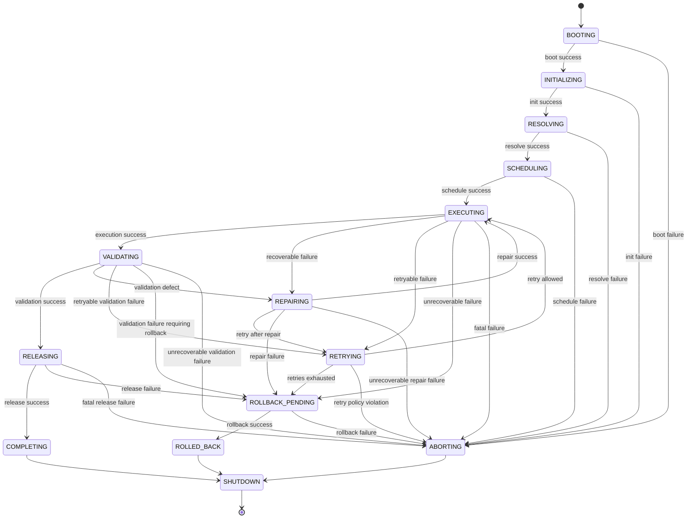
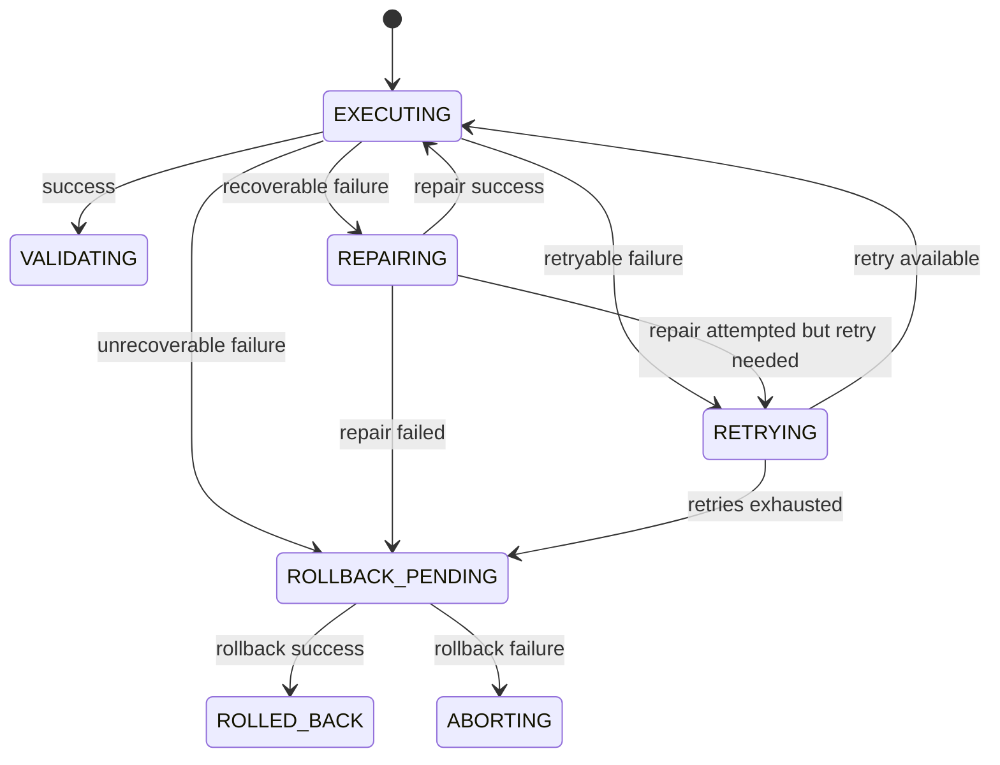

# V6 Runtime State Machine

## Status

This document is a specification-only definition of the SATSET AI Factory V6 runtime state machine. It is normative. The key words MUST, MUST NOT, SHOULD, and MAY are to be interpreted as described in RFC 2119.

## 1. Overview

The V6 runtime MUST operate as a deterministic state machine. Every runtime operation MUST transition through a defined state sequence. The runtime MUST preserve state history, MUST emit state transition events, and MUST prevent invalid transitions.

## 2. States

The runtime MUST define the following normative states:

- BOOTING
- INITIALIZING
- RESOLVING
- SCHEDULING
- EXECUTING
- VALIDATING
- REPAIRING
- RETRYING
- RELEASING
- COMPLETING
- ABORTING
- ROLLBACK_PENDING
- ROLLED_BACK
- SHUTDOWN

The runtime MUST treat the state machine as a single, governed lifecycle for each run.

## 3. State Definitions

### 3.1 Boot

The runtime MUST enter BOOTING when a run is launched or restored. During BOOTING, the runtime MUST initialize execution context, load configuration, and establish the execution environment.

If boot fails, the runtime MUST transition to ABORTING.

### 3.2 Initialize

The runtime MUST enter INITIALIZING after successful boot. During INITIALIZING, the runtime MUST prepare registries, contracts, manifests, and dependencies.

If initialization fails, the runtime MUST transition to ABORTING.

### 3.3 Resolve

The runtime MUST enter RESOLVING after initialization. During RESOLVING, the runtime MUST resolve engines, pipelines, dependencies, and required artifacts.

If resolution fails, the runtime MUST transition to ABORTING.

### 3.4 Schedule

The runtime MUST enter SCHEDULING after resolution. During SCHEDULING, the runtime MUST determine the execution order, dependency readiness, and eligibility for parallel or sequential execution.

If scheduling fails, the runtime MUST transition to ABORTING.

### 3.5 Execute

The runtime MUST enter EXECUTING when an eligible engine or stage is dispatched. During EXECUTING, the runtime MUST run the engine or stage under the declared timeout and policy constraints.

If execution fails and the failure is recoverable, the runtime MUST transition to REPAIRING or RETRYING. If execution fails and the failure is unrecoverable, the runtime MUST transition to ABORTING or ROLLBACK_PENDING.

### 3.6 Validate

The runtime MUST enter VALIDATING after execution or repair. During VALIDATING, the runtime MUST verify outputs, artifacts, hashes, contracts, and dependency results.

If validation fails, the runtime MUST transition to REPAIRING or RETRYING when policy permits; otherwise it MUST transition to ABORTING or ROLLBACK_PENDING.

### 3.7 Repair

The runtime MUST enter REPAIRING when a recoverable defect has been identified. During REPAIRING, the runtime MUST apply the prescribed repair action, produce evidence, and re-enter the relevant execution or validation stage.

If repair succeeds, the runtime MUST transition back to EXECUTING or VALIDATING. If repair fails, the runtime MUST transition to RETRYING, ABORTING, or ROLLBACK_PENDING depending on policy.

### 3.8 Retry

The runtime MUST enter RETRYING when a retryable failure occurs. During RETRYING, the runtime MUST honor the bounded retry policy, backoff rules, and attempt counters.

If retries are exhausted, the runtime MUST transition to ABORTING or ROLLBACK_PENDING.

### 3.9 Release

The runtime MUST enter RELEASING after all required validation and repair steps have completed successfully. During RELEASING, the runtime MUST publish or finalize outputs and produce release artifacts.

If release fails, the runtime MUST transition to ROLLBACK_PENDING or ABORTING.

### 3.10 Complete

The runtime MUST enter COMPLETING after successful release. During COMPLETING, the runtime MUST record the terminal success state, publish final results, and prepare shutdown.

### 3.11 Abort

The runtime MUST enter ABORTING when the run cannot continue due to unrecoverable error, invalid contract, failed validation, or policy violation.

ABORTING MUST preserve the reason code, evidence, and transition history.

### 3.12 Rollback

The runtime MUST enter ROLLBACK_PENDING when a failure requires compensation for partial side effects. During ROLLBACK_PENDING, the runtime MUST determine rollback eligibility and required rollback actions.

If rollback succeeds, the runtime MUST transition to ROLLED_BACK. If rollback fails, the runtime MUST remain in an observable failure state and MUST record the failure.

### 3.13 Shutdown

The runtime MUST enter SHUTDOWN after completion, abort, or rollback. During SHUTDOWN, the runtime MUST close resources, finalize logs and metrics, and mark the run as terminal.

## 4. Transition Rules

The runtime MUST enforce the following transition rules:

- A run MUST NOT transition to a state that is not defined by this specification.
- A transition MUST be recorded with timestamp, prior state, next state, and reason.
- Terminal states MUST be reached only through a defined path.
- The runtime MUST NOT silently skip validation, repair, rollback, or release when policy requires them.
- The runtime MUST preserve a deterministic transition order for equivalent runs.

## 5. Mermaid Diagram: Main Lifecycle

## 6. Mermaid Diagram: Error Recovery Subgraph

## 7. Normative Summary

The V6 runtime state machine MUST be deterministic, observable, and recoverable. Any implementation that does not preserve these state transitions and transition rules is non-compliant with the V6 specification.
