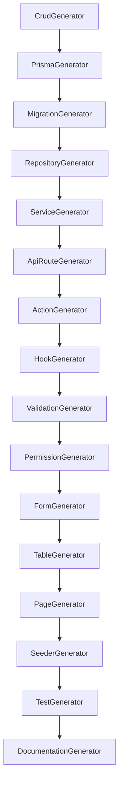

# Destinasi CRUD Module

## Generated Artifacts

- Prisma Schema
- Migration
- Repository
- Service
- Action
- API Route
- Hook
- Validation
- Permission
- Form
- Table
- List/Detail/Create/Edit Pages
- Seeder
- Unit/Snapshot/Regression Tests
- Documentation

## Dependency Graph

