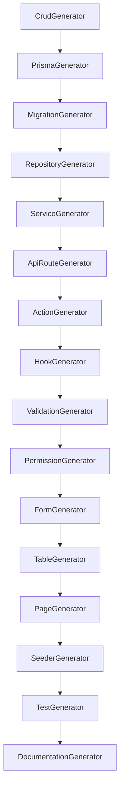

# SATSET CRUD Generator Universal

## Command

- `generate module <EntityName>`
- `make module <EntityName>`

## Orchestrator Chain

1. CrudGenerator
2. PrismaGenerator
3. MigrationGenerator
4. RepositoryGenerator
5. ServiceGenerator
6. ApiRouteGenerator
7. ActionGenerator
8. HookGenerator
9. ValidationGenerator
10. PermissionGenerator
11. FormGenerator
12. TableGenerator
13. PageGenerator
14. SeederGenerator
15. TestGenerator
16. DocumentationGenerator

## Dependency Graph

## Generated Artifacts

- Prisma schema and migration
- Repository and service
- API route and actions
- Hook, validation, permission
- Form and table
- List/detail/create/edit pages
- Delete handler
- Seeder
- Unit/snapshot/regression tests
- Documentation
