# SATSET Identity Generator

## Architecture

IdentityGenerator is implemented as `IdentityGeneratorPlugin` and injected by composition through `useIdentity()`/`registerIdentity()`.
All module generation targets include IdentityGenerator as a mandatory dependency.

## Folder Structure

- `tools/generator/src/plugins/IdentityGeneratorPlugin.ts`
- `tools/generator/src/core/IdentityRegistry.ts`
- `tools/generator/templates/identity/*`
- `tools/autofix/src/IdentityManualDetector.ts`
- `tools/autofix/src/rules/IdentityMigrationRule.ts`

## Lifecycle Login

1. Validate credential input (email/username/phone).
2. Validate password policy and verify hash.
3. Trigger OTP/MFA when enabled.
4. Resolve role and permission policy.
5. Issue JWT/access token, refresh token, and session record.
6. Append login audit trail.

## Lifecycle Session

1. Create session with remember-me and device identity.
2. Validate active session and expiration.
3. Support concurrent sessions.
4. Support revoke single session and logout-all-devices.
5. Cleanup expired session records.

## Lifecycle Permission

1. Resolve user-role mapping.
2. Resolve role-permission mapping.
3. Build permission tree.
4. Evaluate guard/middleware contract.
5. Append permission change audit.

## Lifecycle Password

1. Validate strength and policy.
2. Verify existing hash.
3. Rotate hash and update password history.
4. Enforce expiration policy.
5. Support forgot/reset/change password.

## Extension Point

- SSO provider adapters.
- Magic link provider adapters.
- Secret manager adapters.
- Session store adapters.
- Audit sink adapters.

## Cara Dipakai Generator Lain

- `registerIdentity("finance")`
- `useIdentity("finance", "module")`

Generator lain tidak boleh membuat login/password/auth/session/permission secara manual.

## Dependency Graph

```mermaid
graph TD
  Identity[Identity]
  Identity --> Dashboard
  Identity --> ERP
  Identity --> CRM
  Identity --> POS
  Identity --> Finance
  Identity --> HR
  Identity --> Inventory
  Identity --> Warehouse
  Identity --> Purchasing
  Identity --> Reservation
  Identity --> Ticket
  Identity --> Visitor
  Identity --> Destination
  Identity --> Reporting
  Identity --> Analytics
  Identity --> Notification
  Identity --> Workflow
  Identity --> MasterData
  Identity --> Cafe
  Identity --> Restaurant
  Identity --> Souvenir
  Identity --> Membership
  Identity --> Loyalty
  Identity --> Employee
  Identity --> Supplier
  Identity --> Vendor
  Identity --> Customer
```

